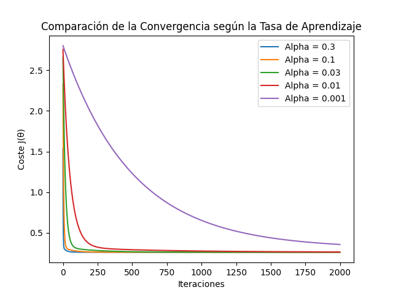
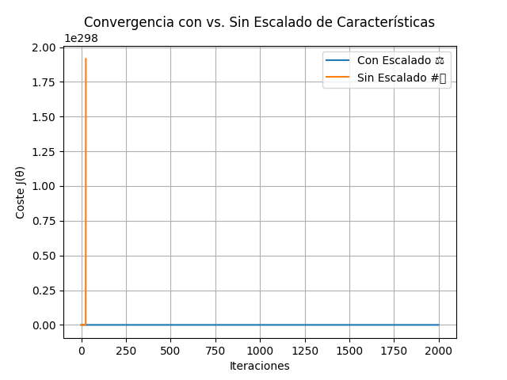
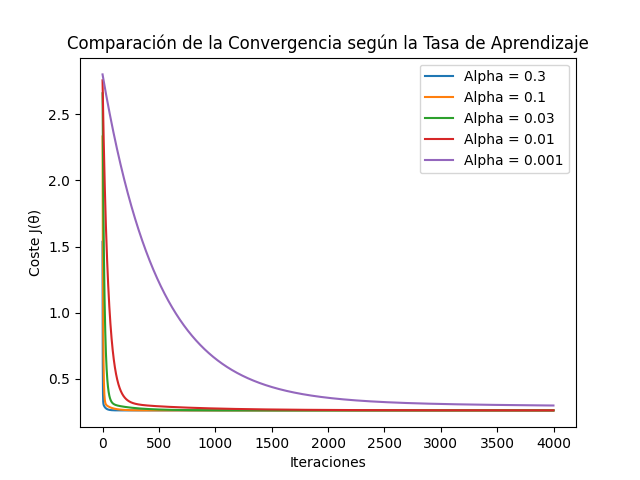

# My-AI-Mission

# Misión 1: Álgebra Lineal con Python Puro

Breve descripción del proyecto: Implementación de operaciones básicas de matrices (suma, multiplicación por escalar, multiplicación de matrices, traspuesta) usando únicamente Python puro, junto con explicaciones de los conceptos fundamentales involucrados.

## 📂 Código Python (`Algebra_lineal.py`)

Este archivo contiene las funciones desarrolladas para realizar las operaciones matriciales solicitadas: suma de matrices, multiplicación por escalar, multiplicación de matrices y trasposición.

## 📘 Explicaciones Conceptuales

### 1. Vectores y Combinaciones Lineales

- **Vector:** Una lista ordenada de números (componentes) que representa una magnitud con dirección en un espacio.
- **Combinación Lineal:** Es una operación en la que cada vector se multiplica por un escalar y luego se suman los vectores resultantes.

### 2. Multiplicación de Matrices

* **¿Cómo funciona?:** Cada elemento de la matriz resultante se calcula mediante el producto punto de una fila de la primera matriz y una columna de la segunda matriz (se multiplican los elementos correspondientes y se suman los resultados).
* **¿Por qué importan las dimensiones?:** Son cruciales para determinar si la multiplicación es posible y cuál será el tamaño del resultado.
    * **Condición:** Para multiplicar A (m x n) por B (p x q), es necesario que `n = p` (el número de columnas de A debe ser igual al número de filas de B).
    * **Tamaño del Resultado:** Si la condición se cumple, la matriz resultado será de tamaño m x q (filas de A x columnas de B).
    * **Razón:** La condición `n = p` es necesaria para poder realizar la operación fila-por-columna (producto punto).
      
### 3. Traspuesta de una Matriz

- **¿Cómo se obtiene?:** Se intercambian filas por columnas. Es decir, la fila \( i \) de la matriz original se convierte en la columna \( i \) de la traspuesta.
  
- **¿Para qué sirve?:** Facilita reorganizar datos, simplificar fórmulas matemáticas y es muy usada en áreas como Machine Learning para manipular vectores, pesos y operaciones matriciales..

### ❓ ¿Por qué la multiplicación de matrices *no* es conmutativa en general (\( AB \neq BA \))?

Las matrices representan transformaciones (como rotaciones o escalados), y aplicar una transformación seguida de otra no necesariamente da el mismo resultado si se invierte el orden. Además:

- Puede que \( A \times B \) sea posible pero \( B \times A \) no, debido a la incompatibilidad de dimensiones.
- Incluso si ambas multiplicaciones son posibles, el tamaño del resultado puede ser diferente.
- Y aun si el tamaño coincide, el contenido generalmente **no será el mismo**.

### ❓ ¿Cuál es la intuición geométrica detrás de la traspuesta?

- **Perspectiva:** Se puede ver como un cambio de enfoque: si las filas representan personas y las columnas características, al trasponer la matriz, ahora las filas representan características y las columnas personas que comparten esas características.
  
- **Reflejo:** Visualmente, es como reflejar la matriz sobre su **diagonal principal**, intercambiando filas por columnas.

# Preguntas de la Misión 1:

## ¿Por qué la multiplicación de matrices NO es conmutativa en general (AB != BA)?

**Porque** las matrices representan transformaciones, representan rotaciones, etc. **básicamente** cuando multiplicas estas aplicando una **transformación**, por lo tanto no puede ser conmutativa. **También** podemos pensar A\*B sea posible pero tal vez B\*A no, **porque** tal vez no sean compatibles (columna de la primera con filas de la segunda). **Aun así**, en el caso de que sea posible A\*B y B\*A, puede que el tamaño resultante no sea el mismo.

### ¿Cuál es la intuición geométrica (si la hay) detrás de la traspuesta?

* **Perspectiva:** Podemos pensarlo como un cambio de enfoque. Por ejemplo, si las filas representan personas y las columnas características, al trasponer la matriz, las filas pasarían a representar las características, y las columnas a las personas que las poseen.
* **Reflejo:** También puede visualizarse como reflejar la matriz en su diagonal principal, intercambiando filas por columnas.

# Misión 2

## ¿Qué es PCA?

PCA, por sus siglas **(Análisis de Componentes Principales)**, es una técnica que se usa para reducir la cantidad de variables en un conjunto de datos, sin perder demasiada información.

## ¿Para qué sirve?

* Nos permite **visualizar datos complejos.** Por ejemplo, podemos pasar de 4 dimensiones a 2 y graficarlos.
* **También** podemos eliminar variables que no aportan mucho o que no son tan importantes.

## ¿Cómo se elige cuántos componentes usar (el valor de $k$)?

Al hacer PCA para reducir dimensiones (por ejemplo, de 4 a $k$), la gran pregunta es: ¿cuántos componentes ($k$) debemos conservar para quedarnos con la información más importante sin perder demasiado? Aquí entran los conceptos de **varianza explicada** y **varianza acumulada**.

* **Varianza Explicada:** Cada componente principal (CP) "explica" un cierto porcentaje de la variación total de los datos. El primer CP explica la mayor parte, el segundo un poco menos, y así sucesivamente. Este porcentaje está directamente relacionado con el tamaño de su valor propio (eigenvalue) o su valor singular al cuadrado ($s^2$) comparado con la suma total de todos ellos. Es como preguntarse: "¿Cuánto de la 'historia completa' de los datos me cuenta esta dirección principal?"

* **Varianza Acumulada:** Es simplemente ir sumando los porcentajes de varianza explicada de los primeros componentes. Por ejemplo, la varianza acumulada por los 2 primeros CP es (Varianza del CP1) + (Varianza del CP2).

**Métodos para elegir $k$:**

1.  **Umbral de Varianza Acumulada (El más común):**
    * Decidimos qué porcentaje de la varianza total original queremos conservar (un valor típico es entre 90% y 99%, por ejemplo, 95%).
    * Calculamos la varianza explicada acumulada al usar 1 componente, luego 2, luego 3...
    * Elegimos el **menor número $k$** de componentes cuya varianza acumulada **alcance o supere** nuestro umbral (ej: el primer $k$ que explique al menos el 95% de la varianza).

2.  **Método del "Codo" (Visual):**
    * Se grafica la varianza explicada por cada componente (ordenados de mayor a menor).
    * Se busca un punto en el gráfico donde la curva "se dobla" como un codo y empieza a aplanarse. El "codo" sugiere el punto donde añadir más componentes ya no aporta una cantidad significativa de información nueva. El valor de $k$ se elige en ese codo.

## Pasos clave de mi implementación

1.  **Cargamos** el dataset de Iris, que tiene 4 variables por flor.
2.  **Centramos** los datos, restando la media de cada característica.
3.  **Calculamos** la matriz de covarianza:
    * Aquí calculamos la matriz de covarianza, que **básicamente** nos dice cómo se mueven las variables entre sí. Es como una tabla que nos muestra si dos variables tienden a aumentar o disminuir juntas. Es clave para ver las relaciones entre las características.
4.  **Calculamos** los valores propios y vectores propios:
    * Los valores propios nos dicen **cuánta** "importancia" tiene cada dirección de variación.
    * Los vectores propios nos indican en qué dirección ocurren esas variaciones.
5.  **Ordenamos** los vectores propios de mayor a menor según la varianza que explican. Así sabemos qué direcciones son las más importantes y capturan la mayor parte de la información.
6.  **Seleccionamos** los dos primeros componentes principales para proyectar los datos, y así poder visualizarlos.
7.  **Aquí utilizamos** una alternativa usando SVD (Descomposición en Valores Singulares):
    * Como alternativa, usamos SVD, que es otra forma de descomponer los datos. En lugar de calcular la matriz de covarianza, directamente obtenemos las direcciones principales usando SVD. Los vectores fila de `Vh` nos dan las direcciones principales.
8.  **Proyección final alternativa usando SVD**:
    * Proyectamos los datos usando los primeros dos componentes principales que conseguimos a través de SVD. Esto también nos reduce la dimensionalidad y nos permite ver los datos en 2D.
9.  **Visualización**:
    * Finalmente, **graficamos** los datos proyectados en 2D, usando los dos componentes principales seleccionados. Esto nos da una visualización más sencilla de los datos, para poder ver patrones o relaciones.

## Conexión: Matriz de Covarianza y Varianza

Pensemos en los **números** de la diagonal principal (de arriba a la izquierda hacia abajo a la derecha), estos son la **varianza**, te dicen **cuánto varía** cada variable por sí sola; si es grande, cambia mucho entre los datos.
Los **números** que quedan fuera de la diagonal son la **covarianza** entre pares de variables, estas nos dicen **cómo varían** juntas dos **características**.

* Si el número es positivo y grande, cuando una sube, la otra también tiende a subir.
* Si es negativo, cuando una sube, la otra baja.
* Si es cerca de cero, no hay mucha relación.

### ¿Por qué nos ayudan a entender la estructura de datos?

**Porque** nos dan pista de **cómo están** distribuidos los datos y sus relaciones.

* Si una varianza es muy grande, quiere decir que esa variable es muy dispersa, cambia mucho entre muestra y muestra. **Tal vez** sea importante.
* Si una covarianza fuera de la diagonal es grande y positiva, significa que esas dos variables **están** relacionadas, se mueven “juntas”. Eso es útil porque **podríamos** reducir dimensiones, ya que **están** diciendo cosas parecidas.

### BÁSICAMENTE

* Qué variables **cambian mucho** (varianzas).
* Qué variables **están** conectadas entre sí (covarianzas).

## Conexión: Eigenvectores/Eigenvalores y Varianza

Los **vectores propios** son como flechas que te dicen hacia dónde se **extienden** los datos, o sea, por donde se dispersan. Los **valores propios** nos dicen **cuánta variación** hay en la **dirección** de su **vector propio** correspondiente.

* Si el valor propio es grande, hay mucha varianza (los datos **están** muy esparcidos en esa dirección).
* Si es pequeño, hay poca varianza (los datos **están** más concentrados).

El **vínculo** es: los vectores propios de la matriz de covarianza nos dan las **direcciones** donde la varianza es máxima, y los valores propios nos dicen **cuánta** varianza hay en cada una de esas direcciones.
En resumen: Los **vectores propios** te dicen por dónde se **están** moviendo más los datos. Los **valores propios** te dicen **cuánto** se **están** moviendo por esas direcciones.

## Conexión: SVD y Varianza

Cuando usamos `U, s, Vh = np.linalg.svd(X_centrado)` estamos haciendo algo muy parecido a lo que hicimos con la matriz de covarianza, pero más directo y más estable.
* La U nos dice **cómo** se ven los datos originales sobre las nuevas direcciones (`Vh`).
* Las filas de `Vh` son las mismas direcciones principales que **habíamos** encontrado con los vectores propios, o sea, por dónde más se esparcen los datos.
* Los valores de `s` (valores singulares) **están** ligados a la varianza:
    * Si haces $s^2$ (s al cuadrado), eso te da una idea de **cuánta** varianza hay en cada dirección.

## En resumen (SVD):

* `Vh`: Hacia dónde mirar (las direcciones principales).
* `s`: **Cuánta** importancia tiene cada dirección (relacionado con la varianza a través de $s^2$).
* `U`: **Cómo** cada punto del dataset se ve desde esas nuevas direcciones.

SVD te da otra forma (más precisa y directa) de encontrar esas direcciones principales importantes (`Vh`) y **cuánta** info hay en cada una ($s^2$). Es como hacer PCA, pero sin tener que **calcular** la matriz de covarianza.

## Cómo Elegir $k$ (Número de Componentes)

Cuando hacemos PCA necesitamos preguntarnos "**¿cuántas direcciones** necesito para obtener lo **más** importante?". **Aquí** entramos en los **conceptos** de **varianza explicada** y **varianza acumulada**.

* **Varianza explicada:** Cada componente principal (esas nuevas direcciones que PCA encuentra) explica una parte de la variación total que hay en tus datos. Es como decir: "**¿Cuánto** de la info original me **está** mostrando esta **dirección**?"
* **Varianza acumulada:** Es la suma de la varianza explicada de los primeros $k$ componentes. Nos ayuda a saber **cuánta información** estamos obteniendo si usamos solo $k$ componentes.

## ¿Cómo saber cuántos componentes necesito para conservar, por ejemplo, el 95% de la info (varianza)?

Primero, **calculás** la varianza que explica cada componente, y **después** vas sumando una por una (eso se llama varianza acumulada).

* **Si usás los `valores_propios` (eigenvalues):**
    * **Sumás** todos los valores propios, eso te da la varianza total.
    * Para cada componente, **dividís** su valor propio entre la varianza total; eso te da el porcentaje de varianza que explica ese componente.
    * Vas sumando esos porcentajes hasta que llegues o pases el umbral del 95%.
* **Si usás los `s` de SVD (valores singulares):**
    * **Elevás** al cuadrado cada número de `s` ($s^2$), eso te dice **cuánta** "varianza" (información) tiene cada componente.
    * **Sumás** todos esos cuadrados; eso te da la información total que hay en los datos.
    * **Después**, para cada componente, **dividís** su valor al cuadrado ($s^2$) entre la suma total → así ves qué porcentaje de info aporta ese componente.
    * Vas sumando esos porcentajes, uno por uno, hasta que la suma llegue al 95%.

## Puedes explicar con una analogía simple o geométrica qué representan los componentes principales? ¿Cómo se relaciona la pérdida de información con la reducción de dimensiones?

**Componentes principales:**
Los componentes principales pueden entenderse como nuevas direcciones o ejes que nos permiten describir los datos de manera más compacta.
Una forma de verlo es imaginar que las fotos representan información. Lo que los componentes principales buscan es organizar esta información de manera que no se pierda demasiado detalle.

En términos visuales, podríamos pensar en dibujar una línea imaginaria que pase por el punto de mayor dispersión de los datos. Esta línea representaría el primer componente principal, la dirección con mayor varianza. Es decir, la línea que captura la mayor parte de la variación en los datos.

Después, podemos dibujar una segunda línea que debe ser ortogonal a la primera. Esta segunda línea captura la mayor cantidad restante de información, es decir, la segunda mayor varianza. Así sucesivamente para cada componente principal.

**Cómo se relaciona la pérdida de información con la reducción de dimensiones:**
Reducir dimensiones es comparable a resumir una historia: retienes lo más importante, pero inevitablemente se pierde parte de la información.
Siguiendo la analogía de los datos como una nube de puntos, el primer componente principal captura la mayor parte de la información contenida en los datos. Sin embargo, como se descartan los componentes restantes, se pierde información.
Esta información perdida corresponde a la varianza explicada por los componentes principales que decidimos no conservar.

# Explicaciones Tarea 3

## Descripción de las operaciones realizadas con Pandas

En la primera parte del script, **utilicé** la **librería** Pandas para realizar varias operaciones de **manipulación** y **análisis** sobre el conjunto de datos de **Iris**. A **continuación**, se **describen** las **principales** operaciones que **realicé**:

* **Carga de datos:** **Utilicé** el **método** `pd.read_csv()` para cargar el archivo `Iris.csv` en un DataFrame llamado `df`. Este DataFrame contiene las **características** de las flores de **Iris**.

* **Visualización de las primeras y últimas filas:** **Usé** `df.head()` para mostrar las primeras 5 filas del DataFrame y obtener una vista **rápida** de los primeros registros. **También** **utilicé** `df.tail()` para ver las **últimas** 5 filas y verificar **cómo** **terminan** los datos.

* **Resumen del DataFrame:** Con `df.info()`, **obtuve** un resumen general del DataFrame, incluyendo el **número** de entradas, el **tipo** de datos de cada columna y la cantidad de valores no nulos.

* **Estadísticas descriptivas:** **Utilicé** `df.describe()` para obtener **estadísticas** descriptivas de las columnas **numéricas** del DataFrame, como la media, **desviación** **estándar**, **mínimos**, **máximos** y percentiles. Posteriormente, **redondeé** los resultados a tres decimales con `.round(3)`.

* **Conteo de categorías:** Para saber **cuántas** veces **aparece** cada valor en la columna `Species`, **utilicé** `df['Species'].value_counts()`, lo que me **dio** la **distribución** de las especies en el conjunto de datos.

* **Selección de filas y columnas por posición:** **Usé** `df.iloc[-1, [1, 3]]` para seleccionar la **última** fila y las columnas en las **posiciones** 1 y 3 (correspondientes a `SepalWidthCm` y `PetalWidthCm`).

* **Selección de filas y columnas por etiquetas:** Con `df.loc[149, ['SepalWidthCm', 'PetalWidthCm']]`, **seleccioné** la fila con el **índice** 149 y las columnas `SepalWidthCm` y `PetalWidthCm` por sus nombres.

* **Filtrado de datos con condiciones combinadas:** **Apliqué** un filtro combinado con `df[(df['Species'] == 'Iris-setosa') & (df['SepalLengthCm'] < 5)]` para seleccionar las filas donde la **especie** es `Iris-setosa` y la **longitud** del **sépalo** es menor a 5.

Estas **operaciones** son fundamentales para explorar y entender los datos antes de pasar a las siguientes etapas del **análisis** o **modelado**.

## Naive Bayes

Podemos pensar en Naive Bayes como un detective que trata de resolver un caso: descubrir qué tipo de flor es una nueva flor que encontró, basándose en la evidencia (sus medidas) y su experiencia previa.

### Pasos del Algoritmo (Implementación)

1.  **Cargar Datos:** Es muy importante empezar importando los datos necesarios, en este caso, usando `load_iris()`. A este resultado le damos un nombre (ej: `datos`). Accedemos a los datos de dos maneras principales:
    * `.data` (guardado en `$X$`): Contiene las características numéricas (las 4 medidas de cada flor).
    * `.target` (guardado en `$Y$`): Contiene las etiquetas de clase (0, 1 o 2) para cada flor.

2.  **Separar Datos por Clase:** Tomamos la matriz `$X$` y, usando las etiquetas `$Y$`, la separamos en tres grupos: uno para cada clase (0, 1 y 2). Así tenemos `X_clase0`, `X_clase1`, `X_clase2`.

3.  **Calcular Estadísticas ("Entrenamiento"):** Una vez separados los datos por clase, calculamos para cada una:
    * **Media (`np.mean(..., axis=0)`):** El valor promedio de cada una de las 4 características para esa clase específica.
    * **Desviación Estándar (`np.std(..., axis=0)`):** Cuánto varían o se dispersan las medidas de cada característica alrededor de su media, para esa clase.
    * **Probabilidad Previa (Prior):** Qué tan común es cada especie en el conjunto total de datos (calculado como: número de flores de la clase / número total de flores).

4.  **Agrupar Estadísticas:** Guardamos todas las medias, desviaciones estándar y priors calculados en listas (`lista_medias`, `lista_stds`, `lista_priors`) para usarlas fácilmente en la predicción.

5.  **Función `gaussian_pdf`:** Definimos una función auxiliar importante. Esta calcula la Densidad de Probabilidad Gaussiana: dado un valor `$x$`, una media `$mu$` y una desviación estándar `$std$`, nos dice qué tan "probable" o "típico" es ese valor `$x$` si perteneciera a una distribución normal (Campana de Gauss) con esa `$mu$` y `$std$`. Es como preguntarle a la campana: "¿Qué altura tenés en este punto `$x$`?".

6.  **Función `predecir_clases_nb` (Predicción):** Esta es la función principal. Recibe una flor nueva (`flor_nueva`) y las listas de estadísticas. Para decidir la clase:
    * Crea una lista vacía (`posteriors`) para guardar los "scores".
    * Usa un bucle `for` para recorrer cada clase posible (0, 1, 2).
    * **Dentro del bucle:**
        * Obtiene las estadísticas (`media_actual`, `std_actual`, `prior_actual`) de la clase actual.
        * Calcula el **Likelihood**: Usa `gaussian_pdf` para obtener la probabilidad de cada una de las 4 características de la `flor_nueva` según la media y `$std$` de la clase actual. Luego, multiplica estas 4 probabilidades (¡la asunción "naive"!) usando `np.prod` para obtener la probabilidad total de observar esas características si la flor fuera de esta clase. (Nota: en el código final usamos logaritmos para evitar problemas numéricos, sumando $\log(\text{PDFs})$ en lugar de multiplicar PDFs).
        * Calcula el **Score Posterior**: Multiplica el `likelihood` por el `prior_actual` (o suma sus logaritmos).
        * Guarda este `posterior_actual` en la lista `posteriors`.
    * **Después del bucle:** Compara los 3 scores guardados en `posteriors` y elige el **índice** (0, 1 o 2) del score más alto usando `np.argmax`.
    * Devuelve ese índice como la clase predicha.

7.  **Probar Nuestro Clasificador:**
    * Hacemos un bucle que recorre todas las flores del dataset original (`$X$`).
    * Para cada flor, llamamos a `predecir_clases_nb` para obtener su predicción.
    * Guardamos todas las predicciones.
    * Calculamos la **Precisión (Accuracy)**: comparamos nuestras predicciones con las etiquetas reales (`$Y$`) y vemos el porcentaje de aciertos.

8.  **Comparar con Scikit-learn:**
    * Usamos la implementación `GaussianNB` de Scikit-learn, la entrenamos (`fit`) y predecimos (`predict`) con los mismos datos `$X$` e `$Y$`.
    * Calculamos su precisión para tener una referencia y ver si nuestro modelo manual da resultados similares.

## Conceptos Clave Relacionados

### Teorema de Bayes (Regla General)

* **¿Qué es?:** Es una fórmula matemática para actualizar una probabilidad o creencia inicial (`Prior`) basándonos en nueva evidencia (`Datos`) para obtener una probabilidad final (`Posterior`).
* **Idea:** $P(\text{Clase} | \text{Datos}) \propto P(\text{Datos} | \text{Clase}) \times P(\text{Clase})$ (El posterior es proporcional al likelihood por el prior).
* **En resumen:** Nos dice cómo combinar lo que ya sabíamos con la nueva evidencia.

### Naive Bayes (El Algoritmo de Clasificación)

* **¿Qué es?:** Un método de clasificación que **usa** el Teorema de Bayes para decidir a qué clase pertenece una nueva muestra.
* **La parte "Naive" (Ingenua):** Su característica principal es que **asume (ingenuamente)** que todas las características (las 4 medidas de la flor) son **independientes entre sí** dada la clase. Esto simplifica muchísimo el cálculo del Likelihood ($P(\text{Datos}|\text{Clase})$), permitiendo multiplicar las probabilidades individuales de cada característica (o sumar sus logaritmos).
* **En resumen:** Aplica Bayes con una simplificación clave (independencia) para clasificar.

### Campana de Gauss (Distribución Normal)

* **¿Qué es?:** Una forma matemática muy común (la curva en forma de campana) que describe cómo se distribuyen muchos datos numéricos alrededor de una media, con una cierta dispersión (desviación estándar).
* **En Gaussian Naive Bayes:** Hacemos la **suposición** de que las características numéricas *dentro de cada clase* siguen esta distribución Gaussiana. Esto nos permite usar la fórmula de la Campana de Gauss (nuestra función `gaussian_pdf`) para calcular las probabilidades $P(\text{característica}_k | \text{Clase})$ que necesitamos para el Likelihood.
* **En resumen:** Es el modelo de probabilidad que usamos para las características numéricas en esta versión específica de Naive Bayes.

### Resumen de la Relación

El **Teorema de Bayes** nos da el marco general. El algoritmo **Naive Bayes** lo aplica para clasificar, añadiendo la suposición "naive" de independencia. La **Campana de Gauss** es la herramienta que usamos en *Gaussian* Naive Bayes para calcular las probabilidades de las características numéricas dentro de ese marco.

# Explicaciones Tarea 4

## Regresión Lineal

### ¿Qué es?

La **regresión lineal** es una técnica estadística que busca la relación entre una variable cuantitativa ($Y$) y una o más variables predictoras ($X$).
El **objetivo** es **predecir valores numéricos continuos**, basándose en la suposición de que existe una relación lineal entre las variables explicativas ($X$) y la variable objetivo ($Y$).

---

### ¿Qué tipo de resultado produce?

**Variable cuantitativa continua:**
No clasifica en categorías, sino que entrega un valor numérico que puede tomar cualquier valor dentro de un rango.

---

### Interpretación de los coeficientes

Los coeficientes del modelo ($\theta$) indican cómo cambia $Y$ ante variaciones en $X$.

---

## Función Hipótesis ($h_\theta(X) = X \theta$)

Ecuación fundamental en la regresión lineal: $h_\theta(X) = X \theta$. Define la relación entre las variables predictoras ($X$) y la variable objetivo ($Y$).

### Objetivo

Predecir valores numéricos continuos basándose en una combinación lineal de características de entrada y coeficientes asociados.

### Elementos

1.  **$X$**: Matriz de características (inputs)
    * Cada fila representa una observación (ejemplo de entrenamiento)
    * Cada columna corresponde a una característica (variable predictora)
    * Se agrega una columna de unos para incluir el intercepto ($\theta_0$)

2.  **$\theta$**: Vector de parámetros (coeficientes)
    * Contiene los pesos que el modelo aprende durante el entrenamiento
    * Incluye el intercepto ($\theta_0$)
    * $\theta_1, \theta_2, \dots$ indican la influencia de cada característica

3.  **$h_\theta(X)$**: Predicción del modelo
    * Resultado del producto matricial $X\theta$
    * Cada valor $h_\theta(x^{(i)})$ es la predicción para la observación $i$

---

## Función de Coste (MSE)

**Fórmula:**
$J(\theta) = \frac{1}{2m} \sum_{i=1}^{m} (h_\theta(x^{(i)}) - y^{(i)})^2$

Mide el **promedio del error cuadrático** entre las predicciones del modelo y los valores reales en todo el conjunto de datos.

* **$m$**: Número de observaciones
* **$h_\theta(x^{(i)})$**: Predicción para la observación $i$
* **$y^{(i)}$**: Valor real para la observación $i$

---

### ¿Por qué se eleva al cuadrado la diferencia?

1.  **Evita errores negativos:** Las diferencias se vuelven positivas.
2.  **Penaliza errores grandes:** Un error de 2 pesa más (4) que uno de 1 (1).
3.  **Facilita la optimización:** La función cuadrática es convexa y garantiza un mínimo global.

---

## ¿Por qué queremos minimizar $J(\theta)$?

Minimizar $J(\theta)$ significa ajustar los parámetros $\theta$ para que las predicciones sean lo más cercanas posible a los valores reales.

### Métodos comunes:

* **Mínimos Cuadrados Ordinarios (OLS):** Solución analítica.
* **Descenso de Gradiente (GD):** Método iterativo.

---

## ¿Qué implica un $J(\theta)$ pequeño?

* **Buen ajuste:** Las predicciones están cerca de los valores reales.
* **Alta precisión:** El modelo generaliza bien.
* **Menor incertidumbre:** Los errores (residuos) tienen baja variabilidad.

---

# Descenso de Gradiente (Gradient Descent)

El **descenso de gradiente** busca minimizar $J(\theta)$, ajustando iterativamente los parámetros $\theta$ para reducir el error.

### En resumen:

Es un método que permite a un modelo **aprender** los mejores valores de los parámetros $\theta$, optimizando la predicción. El resultado del entrenamiento es el vector `theta_final`, que contiene los coeficientes óptimos encontrados por el modelo.

---

## Regla de Actualización

$\theta_j := \theta_j - \alpha \frac{\partial}{\partial \theta_j} J(\theta)$ (Esta es la regla implícita que se describe)

### Componentes

**$\alpha$ (Tasa de Aprendizaje):**

* Controla el tamaño del paso en cada iteración.
* $\alpha$ alto → puede hacer que el algoritmo no converja.
* $\alpha$ bajo → puede hacer que la convergencia sea muy lenta.

**Derivada Parcial ($\frac{\partial}{\partial \theta_j} J(\theta)$):**

* Mide la dirección de mayor aumento de $J(\theta)$
* Al restarla, el modelo se mueve en dirección descendente (hacia el mínimo).

---

## Gradiente Vectorizado

**Fórmula:**
$\nabla J(\theta) = \frac{1}{m} X^T (X\theta - y)$

### Términos

1.  **$X\theta$**: Vector de predicciones para todas las observaciones.
2.  **$X\theta - y$**: Vector de errores residuales.
3.  **$X^T$**: Multiplicación por la transpuesta de $X$ pondera los errores por cada característica.
4.  **$\frac{1}{m}$**: Promedia el gradiente sobre el conjunto de datos.

---

## ¿Qué representa el resultado?

El vector $\nabla J(\theta)$ nos dice:

* **Dirección:**
    * Si $\frac{\partial J}{\partial \theta_j} > 0$ = disminuir $\theta_j$
    * Si $\frac{\partial J}{\partial \theta_j} < 0$ = aumentar $\theta_j$

* **Magnitud:**
    * Cuánto influye ese $\theta_j$ en el error total

---

## Resumen

* **Objetivo:** Minimizar $J(\theta)$ ajustando $\theta$ para reducir errores
* **Tasa de Aprendizaje ($\alpha$):** Controla la velocidad de convergencia
* **Gradiente Vectorizado:** Forma eficiente de calcular el ajuste de todos los coeficientes a la vez

# 📘 Pasos del Algoritmo de Regresión Lineal (California Housing)

## 1. 🗂️ Importación de Datos

Importamos el dataset **California Housing** y las funciones necesarias de **NumPy**.

* `.data`: contiene las **características** (features), en forma de matriz ($X$).
* `.target`: contiene los **valores a predecir** (precios promedio de casas) ($Y$).

Se ajustó la forma de $Y$ usando `np.reshape` para trabajar con matrices columna, sin alterar los datos.

---

## 2. ⚖️ Normalización (Estandarización)

Calculamos la **media ($\mu$)** y **desviación estándar ($\sigma$)** de los datos originales para escalar las características. Esto es clave porque:

* Las variables originales tienen diferentes escalas.
* Sin escalar, el descenso de gradiente puede ser lento o ineficaz.
* El escalado mejora la velocidad y estabilidad del entrenamiento.

**🔧 Sin este paso, el modelo devolvía `null` en `theta_final`, sin importar los hiperparámetros.**

---

## 3. ➕ Agregar Columna de Unos (Bias)

Se añadió una columna de unos a `X_scaled` para permitir que el modelo aprenda un **término independiente** ($\theta_0$), haciendo que la recta **no tenga que pasar por el origen (0,0)**.
Esto da **flexibilidad** al modelo.

---

## 4. 🔮 Función de Hipótesis

Se implementó la función `calcular_hipotesis(X, theta)`:

* Predice valores continuos.
* Es la base de la fórmula de **regresión lineal**:
    $h(\theta) = X \theta$

---

## 5. ❌ Función de Coste (MSE)

Se implementó la función de coste: **Error Cuadrático Medio (Mean Squared Error)**. $J(\theta)$.

Mide el **promedio del error al cuadrado** entre predicciones ($h_\theta(x^{(i)})$) y valores reales ($y^{(i)}$).

📉 El objetivo es **minimizarla**:

* **MSE alta** → el modelo se equivoca mucho.
* **MSE baja** → el modelo está aprendiendo bien.

---

## 6. 🔁 Descenso de Gradiente

Se implementó el **descenso de gradiente** para minimizar el error:

* Calcula predicciones, errores y gradiente ($\nabla J(\theta)$) en cada iteración.
* Actualiza $\theta$ con la regla de aprendizaje:
    $\theta := \theta - \alpha \nabla J(\theta)$

Se definieron:

* `theta_inicial`: vector de ceros
* `$\alpha$` (tasa de aprendizaje)
* `n_iteraciones`

También se graficó el **historial de coste** para visualizar la convergencia del algoritmo.

**La gráfica mostró que el coste convergió de forma estable a un valor aproximado de X.XX después de unas YYY iteraciones.** (<- **¡RECUERDA REEMPLAZAR X.XX e YYY con tus valores!**)

---

## 7. 🤖 Función de Predicción

La función `predecir(X_nuevos, theta_final, mu, sigma)` permite usar el modelo entrenado con **nuevos datos**:

1.  Escala los nuevos datos con $\mu$ y $\sigma$ del entrenamiento.
2.  Añade la columna de unos (bias).
3.  Aplica la fórmula de regresión lineal ($h_\theta(X) = X \theta$) para predecir precios.

---

## ✅ Conclusión

Este modelo permite predecir el precio promedio de casas en California usando regresión lineal multivariable, correctamente entrenada y escalada.
Con el descenso de gradiente y la MSE como guía, podemos ajustar $\theta$ hasta encontrar una solución eficiente y precisa.

## Punto 1: Consolidar el Aprendizaje 🧠

Dependiendo del valor de **alpha**, podemos observar cuánto tiempo tarda en **converger** el algoritmo.

* Si el **alpha es muy pequeño**, el descenso de gradiente avanza muy lento.
* Si el **alpha es muy grande**, el algoritmo puede **omitir el aprendizaje** o incluso **divergir** (los valores crecen en lugar de estabilizarse).

📈
*Figura 1*

Gracias a la comparación de los valores en la gráfica, podemos encontrar un **alpha ideal**:

📉
*Figura 2*

Sin el **escalado**, el descenso de gradiente tarda más o simplemente **no converge** (pueden aparecer datos 'null').
En cambio, cuando **escalamos las características**:

* Las variables tienen una magnitud parecida.
* El algoritmo avanza mejor.
* Se pueden usar valores de alpha más grandes sin que se vuelva inestable.
* Todo converge de forma más rápida y eficiente.

*Gráfico del historial de coste*

### ✅ En resumen:

* Escalar las características mejora la **eficiencia del algoritmo**.
* Elegir bien el valor de **alpha** hace que el modelo **converja más rápido** sin salirse de control.

##  Punto 2: Evaluar el Número de Iteraciones ⏱️

Con distintos valores de alpha, podemos observar que, aproximadamente a partir de las 2500 iteraciones, las curvas comienzan a aplanarse. Esto indica que el algoritmo empieza a converger, ya que el coste deja de disminuir significativamente.

En mi experimento utilicé 4000 iteraciones como número total. Elegí este valor porque, al probar varios valores de alpha, quería asegurarme de observar con claridad en qué punto cada curva se aplanaba por completo. Esto me permitió identificar con mayor precisión cuándo el algoritmo realmente comenzaba a converger en cada caso.

# Regresión Lineal: Ecuación Normal vs Descenso de Gradiente  

## Estructura de la Matriz **X** y el Vector **y**  
### **Matriz X (Diseño)**  
- **Contenido**:  
  - Columna de **unos (1)** para el intercepto (`θ₀`).  
  - Columnas de **características** (`X₁, X₂, ..., Xₙ`).  
- **Dimensiones**:  
  `m × (n+1)`  *(m observaciones, n características)*  

### **Vector y (Objetivo)**  
- **Contenido**: Valores reales a predecir.  
- **Dimensiones**:  
  `m × 1`  

## 🔍 **Comparaciones Clave**  
### 📊 Resultados Experimentales  
| **Escenario**            | Diferencia (Error) | Comparación Válida |  
|--------------------------|--------------------|--------------------|  
| Theta GD (escalado) vs Theta EN (**sin escalar**) | ≈ 111              | ❌ No (escalas distintas) |  
| Theta GD (escalado) vs Theta EN (**escalado**)    | ≈ 9.9              | ✅ Sí               |  

### ❓ **Interpretación**  
1. **Diferencia ≈ 111**:  
   - Ilustra cómo el **escalado afecta los valores absolutos de `θ`**.  
   - **No es válida técnicamente** (comparar `θ` en escalas diferentes no tiene sentido matemático).  

2. **Diferencia ≈ 9.9**:  
   - Muestra que el Descenso de Gradiente (**GD**) **no convergió totalmente** por falta de iteraciones.  

---

## 🧮 **Ecuación Normal: Fórmula e Implementación**  
### **Fórmula Analítica**  

θ = (Xᵗ X)⁻¹ Xᵗ y

### **Pasos de Implementación**  
1. Calcular `Xᵗ X`.  
2. Invertir la matriz resultante.  
3. Multiplicar por `Xᵗ y`.  

## ⚖️ **Pros y Contras**  
| **Método**           | **Ecuación Normal**                              | **Descenso de Gradiente**                     |  
|----------------------|--------------------------------------------------|-----------------------------------------------|  
| **Ventajas**         | - Solución exacta en 1 paso. - Sin hiperparámetros. - No requiere escalado. | - Escalable a grandes `n`. - Funciona incluso si `Xᵗ X` es singular. |  
| **Desventajas**      | - Coste `O(n³)` (lento para `n > 10⁴`). - Falla si `Xᵗ X` no es invertible. | - Necesita ajustar `α` e iteraciones. - Requiere escalado para converger bien. |  

---

## 🚀 **¿Cuándo Usar Cada Método?**  
| **Criterio**               | **Ecuación Normal**          | **Descenso de Gradiente**       |  
|----------------------------|------------------------------|---------------------------------|  
| **Número de características** | `n < 10⁴`                 | `n ≥ 10⁴`                      |  
| **Estabilidad matricial**  | Evitar si `Xᵗ X` es singular | Funciona siempre               |  
| **Recursos computacionales** | Adecuado para CPU/GPU moderadas | Ideal para clusters distribuidos |  

---

**Notas Finales**:  
- Usar `np.linalg.pinv` en lugar de `inv` para manejar matrices singulares.  
- El escalado en GD es **crítico** para convergencia rápida y estable.  

