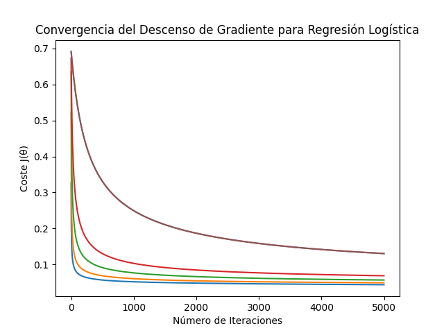
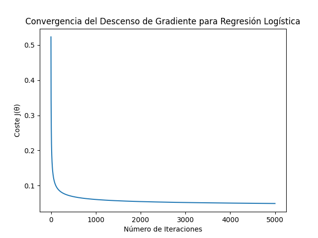

# My-AI-Mission

# Misión 1: Álgebra Lineal con Python Puro

Breve descripción del proyecto: Implementación de operaciones básicas de matrices (suma, multiplicación por escalar, multiplicación de matrices, traspuesta) usando únicamente Python puro, junto con explicaciones de los conceptos fundamentales involucrados.

## 📂 Código Python (`Algebra_lineal.py`)

Este archivo contiene las funciones desarrolladas para realizar las operaciones matriciales solicitadas: suma de matrices, multiplicación por escalar, multiplicación de matrices y trasposición.

## 📘 Explicaciones Conceptuales

### 1. Vectores y Combinaciones Lineales

- **Vector:** Una lista ordenada de números (componentes) que representa una magnitud con dirección en un espacio.
- **Combinación Lineal:** Es una operación en la que cada vector se multiplica por un escalar y luego se suman los vectores resultantes.

### 2. Multiplicación de Matrices

* **¿Cómo funciona?:** Cada elemento de la matriz resultante se calcula mediante el producto punto de una fila de la primera matriz y una columna de la segunda matriz (se multiplican los elementos correspondientes y se suman los resultados).
* **¿Por qué importan las dimensiones?:** Son cruciales para determinar si la multiplicación es posible y cuál será el tamaño del resultado.
    * **Condición:** Para multiplicar A (m x n) por B (p x q), es necesario que `n = p` (el número de columnas de A debe ser igual al número de filas de B).
    * **Tamaño del Resultado:** Si la condición se cumple, la matriz resultado será de tamaño m x q (filas de A x columnas de B).
    * **Razón:** La condición `n = p` es necesaria para poder realizar la operación fila-por-columna (producto punto).
      
### 3. Traspuesta de una Matriz

- **¿Cómo se obtiene?:** Se intercambian filas por columnas. Es decir, la fila \( i \) de la matriz original se convierte en la columna \( i \) de la traspuesta.
  
- **¿Para qué sirve?:** Facilita reorganizar datos, simplificar fórmulas matemáticas y es muy usada en áreas como Machine Learning para manipular vectores, pesos y operaciones matriciales..

### ❓ ¿Por qué la multiplicación de matrices *no* es conmutativa en general (\( AB \neq BA \))?

Las matrices representan transformaciones (como rotaciones o escalados), y aplicar una transformación seguida de otra no necesariamente da el mismo resultado si se invierte el orden. Además:

- Puede que \( A \times B \) sea posible pero \( B \times A \) no, debido a la incompatibilidad de dimensiones.
- Incluso si ambas multiplicaciones son posibles, el tamaño del resultado puede ser diferente.
- Y aun si el tamaño coincide, el contenido generalmente **no será el mismo**.

### ❓ ¿Cuál es la intuición geométrica detrás de la traspuesta?

- **Perspectiva:** Se puede ver como un cambio de enfoque: si las filas representan personas y las columnas características, al trasponer la matriz, ahora las filas representan características y las columnas personas que comparten esas características.
  
- **Reflejo:** Visualmente, es como reflejar la matriz sobre su **diagonal principal**, intercambiando filas por columnas.


# Preguntas de la Misión 1:

## ¿Por qué la multiplicación de matrices NO es conmutativa en general (AB != BA)?

**Porque** las matrices representan transformaciones, representan rotaciones, etc. **básicamente** cuando multiplicas estas aplicando una **transformación**, por lo tanto no puede ser conmutativa. **También** podemos pensar A\*B sea posible pero tal vez B\*A no, **porque** tal vez no sean compatibles (columna de la primera con filas de la segunda). **Aun así**, en el caso de que sea posible A\*B y B\*A, puede que el tamaño resultante no sea el mismo.

### ¿Cuál es la intuición geométrica (si la hay) detrás de la traspuesta?

* **Perspectiva:** Podemos pensarlo como un cambio de enfoque. Por ejemplo, si las filas representan personas y las columnas características, al trasponer la matriz, las filas pasarían a representar las características, y las colvumnas a las personas que las poseen.
* **Reflejo:** También puede visualizarse como reflejar la matriz en su diagonal principal, intercambiando filas por columnas.


# Misión 2

## ¿Qué es PCA?

PCA, por sus siglas **(Análisis de Componentes Principales)**, es una técnica que se usa para reducir la cantidad de variables en un conjunto de datos, sin perder demasiada información.

## ¿Para qué sirve?

* Nos permite **visualizar datos complejos.** Por ejemplo, podemos pasar de 4 dimensiones a 2 y graficarlos.
* **También** podemos eliminar variables que no aportan mucho o que no son tan importantes.

## ¿Cómo se elige cuántos componentes usar (el valor de $k$)?

Al hacer PCA para reducir dimensiones (por ejemplo, de 4 a $k$), la gran pregunta es: ¿cuántos componentes ($k$) debemos conservar para quedarnos con la información más importante sin perder demasiado? Aquí entran los conceptos de **varianza explicada** y **varianza acumulada**.

* **Varianza Explicada:** Cada componente principal (CP) "explica" un cierto porcentaje de la variación total de los datos. El primer CP explica la mayor parte, el segundo un poco menos, y así sucesivamente. Este porcentaje está directamente relacionado con el tamaño de su valor propio (eigenvalue) o su valor singular al cuadrado ($s^2$) comparado con la suma total de todos ellos. Es como preguntarse: "¿Cuánto de la 'historia completa' de los datos me cuenta esta dirección principal?"

* **Varianza Acumulada:** Es simplemente ir sumando los porcentajes de varianza explicada de los primeros componentes. Por ejemplo, la varianza acumulada por los 2 primeros CP es (Varianza del CP1) + (Varianza del CP2).

**Métodos para elegir $k$:**

1.  **Umbral de Varianza Acumulada (El más común):**
    * Decidimos qué porcentaje de la varianza total original queremos conservar (un valor típico es entre 90% y 99%, por ejemplo, 95%).
    * Calculamos la varianza explicada acumulada al usar 1 componente, luego 2, luego 3...
    * Elegimos el **menor número $k$** de componentes cuya varianza acumulada **alcance o supere** nuestro umbral (ej: el primer $k$ que explique al menos el 95% de la varianza).

2.  **Método del "Codo" (Visual):**
    * Se grafica la varianza explicada por cada componente (ordenados de mayor a menor).
    * Se busca un punto en el gráfico donde la curva "se dobla" como un codo y empieza a aplanarse. El "codo" sugiere el punto donde añadir más componentes ya no aporta una cantidad significativa de información nueva. El valor de $k$ se elige en ese codo.

## Pasos clave de mi implementación

1.  **Cargamos** el dataset de Iris, que tiene 4 variables por flor.
2.  **Centramos** los datos, restando la media de cada característica.
3.  **Calculamos** la matriz de covarianza:
    * Aquí calculamos la matriz de covarianza, que **básicamente** nos dice cómo se mueven las variables entre sí. Es como una tabla que nos muestra si dos variables tienden a aumentar o disminuir juntas. Es clave para ver las relaciones entre las características.
4.  **Calculamos** los valores propios y vectores propios:
    * Los valores propios nos dicen **cuánta** "importancia" tiene cada dirección de variación.
    * Los vectores propios nos indican en qué dirección ocurren esas variaciones.
5.  **Ordenamos** los vectores propios de mayor a menor según la varianza que explican. Así sabemos qué direcciones son las más importantes y capturan la mayor parte de la información.
6.  **Seleccionamos** los dos primeros componentes principales para proyectar los datos, y así poder visualizarlos.
7.  **Aquí utilizamos** una alternativa usando SVD (Descomposición en Valores Singulares):
    * Como alternativa, usamos SVD, que es otra forma de descomponer los datos. En lugar de calcular la matriz de covarianza, directamente obtenemos las direcciones principales usando SVD. Los vectores fila de `Vh` nos dan las direcciones principales.
8.  **Proyección final alternativa usando SVD**:
    * Proyectamos los datos usando los primeros dos componentes principales que conseguimos a través de SVD. Esto también nos reduce la dimensionalidad y nos permite ver los datos en 2D.
9.  **Visualización**:
    * Finalmente, **graficamos** los datos proyectados en 2D, usando los dos componentes principales seleccionados. Esto nos da una visualización más sencilla de los datos, para poder ver patrones o relaciones.

## Conexión: Matriz de Covarianza y Varianza

Pensemos en los **números** de la diagonal principal (de arriba a la izquierda hacia abajo a la derecha), estos son la **varianza**, te dicen **cuánto varía** cada variable por sí sola; si es grande, cambia mucho entre los datos.
Los **números** que quedan fuera de la diagonal son la **covarianza** entre pares de variables, estas nos dicen **cómo varían** juntas dos **características**.

* Si el número es positivo y grande, cuando una sube, la otra también tiende a subir.
* Si es negativo, cuando una sube, la otra baja.
* Si es cerca de cero, no hay mucha relación.

### ¿Por qué nos ayudan a entender la estructura de datos?

**Porque** nos dan pista de **cómo están** distribuidos los datos y sus relaciones.

* Si una varianza es muy grande, quiere decir que esa variable es muy dispersa, cambia mucho entre muestra y muestra. **Tal vez** sea importante.
* Si una covarianza fuera de la diagonal es grande y positiva, significa que esas dos variables **están** relacionadas, se mueven “juntas”. Eso es útil porque **podríamos** reducir dimensiones, ya que **están** diciendo cosas parecidas.

### BÁSICAMENTE

* Qué variables **cambian mucho** (varianzas).
* Qué variables **están** conectadas entre sí (covarianzas).

## Conexión: Eigenvectores/Eigenvalores y Varianza

Los **vectores propios** son como flechas que te dicen hacia dónde se **extienden** los datos, o sea, por donde se dispersan. Los **valores propios** nos dicen **cuánta variación** hay en la **dirección** de su **vector propio** correspondiente.

* Si el valor propio es grande, hay mucha varianza (los datos **están** muy esparcidos en esa dirección).
* Si es pequeño, hay poca varianza (los datos **están** más concentrados).

El **vínculo** es: los vectores propios de la matriz de covarianza nos dan las **direcciones** donde la varianza es máxima, y los valores propios nos dicen **cuánta** varianza hay en cada una de esas direcciones.
En resumen: Los **vectores propios** te dicen por dónde se **están** moviendo más los datos. Los **valores propios** te dicen **cuánto** se **están** moviendo por esas direcciones.

## Conexión: SVD y Varianza

Cuando usamos `U, s, Vh = np.linalg.svd(X_centrado)` estamos haciendo algo muy parecido a lo que hicimos con la matriz de covarianza, pero más directo y más estable.
* La U nos dice **cómo** se ven los datos originales sobre las nuevas direcciones (`Vh`).
* Las filas de `Vh` son las mismas direcciones principales que **habíamos** encontrado con los vectores propios, o sea, por dónde más se esparcen los datos.
* Los valores de `s` (valores singulares) **están** ligados a la varianza:
    * Si haces $s^2$ (s al cuadrado), eso te da una idea de **cuánta** varianza hay en cada dirección.

## En resumen (SVD):

* `Vh`: Hacia dónde mirar (las direcciones principales).
* `s`: **Cuánta** importancia tiene cada dirección (relacionado con la varianza a través de $s^2$).
* `U`: **Cómo** cada punto del dataset se ve desde esas nuevas direcciones.

SVD te da otra forma (más precisa y directa) de encontrar esas direcciones principales importantes (`Vh`) y **cuánta** info hay en cada una ($s^2$). Es como hacer PCA, pero sin tener que **calcular** la matriz de covarianza.

## Cómo Elegir $k$ (Número de Componentes)

Cuando hacemos PCA necesitamos preguntarnos "**¿cuántas direcciones** necesito para obtener lo **más** importante?". **Aquí** entramos en los **conceptos** de **varianza explicada** y **varianza acumulada**.

* **Varianza explicada:** Cada componente principal (esas nuevas direcciones que PCA encuentra) explica una parte de la variación total que hay en tus datos. Es como decir: "**¿Cuánto** de la info original me **está** mostrando esta **dirección**?"
* **Varianza acumulada:** Es la suma de la varianza explicada de los primeros $k$ componentes. Nos ayuda a saber **cuánta información** estamos obteniendo si usamos solo $k$ componentes.

## ¿Cómo saber cuántos componentes necesito para conservar, por ejemplo, el 95% de la info (varianza)?

Primero, **calculás** la varianza que explica cada componente, y **después** vas sumando una por una (eso se llama varianza acumulada).

* **Si usás los `valores_propios` (eigenvalues):**
    * **Sumás** todos los valores propios, eso te da la varianza total.
    * Para cada componente, **dividís** su valor propio entre la varianza total; eso te da el porcentaje de varianza que explica ese componente.
    * Vas sumando esos porcentajes hasta que llegues o pases el umbral del 95%.
* **Si usás los `s` de SVD (valores singulares):**
    * **Elevás** al cuadrado cada número de `s` ($s^2$), eso te dice **cuánta** "varianza" (información) tiene cada componente.
    * **Sumás** todos esos cuadrados; eso te da la información total que hay en los datos.
    * **Después**, para cada componente, **dividís** su valor al cuadrado ($s^2$) entre la suma total → así ves qué porcentaje de info aporta ese componente.
    * Vas sumando esos porcentajes, uno por uno, hasta que la suma llegue al 95%.

## Puedes explicar con una analogía simple o geométrica qué representan los componentes principales? ¿Cómo se relaciona la pérdida de información con la reducción de dimensiones?

**Componentes principales:**
Los componentes principales pueden entenderse como nuevas direcciones o ejes que nos permiten describir los datos de manera más compacta.
Una forma de verlo es imaginar que las fotos representan información. Lo que los componentes principales buscan es organizar esta información de manera que no se pierda demasiado detalle.

En términos visuales, podríamos pensar en dibujar una línea imaginaria que pase por el punto de mayor dispersión de los datos. Esta línea representaría el primer componente principal, la dirección con mayor varianza. Es decir, la línea que captura la mayor parte de la variación en los datos.

Después, podemos dibujar una segunda línea que debe ser ortogonal a la primera. Esta segunda línea captura la mayor cantidad restante de información, es decir, la segunda mayor varianza. Así sucesivamente para cada componente principal.

**Cómo se relaciona la pérdida de información con la reducción de dimensiones:**
Reducir dimensiones es comparable a resumir una historia: retienes lo más importante, pero inevitablemente se pierde parte de la información.
Siguiendo la analogía de los datos como una nube de puntos, el primer componente principal captura la mayor parte de la información contenida en los datos. Sin embargo, como se descartan los componentes restantes, se pierde información.
Esta información perdida corresponde a la varianza explicada por los componentes principales que decidimos no conservar.

# Explicaciones Tarea 3

## Descripción de las operaciones realizadas con Pandas

En la primera parte del script, **utilicé** la **librería** Pandas para realizar varias operaciones de **manipulación** y **análisis** sobre el conjunto de datos de **Iris**. A **continuación**, se **describen** las **principales** operaciones que **realicé**:

* **Carga de datos:** **Utilicé** el **método** `pd.read_csv()` para cargar el archivo `Iris.csv` en un DataFrame llamado `df`. Este DataFrame contiene las **características** de las flores de **Iris**.

* **Visualización de las primeras y últimas filas:** **Usé** `df.head()` para mostrar las primeras 5 filas del DataFrame y obtener una vista **rápida** de los primeros registros. **También** **utilicé** `df.tail()` para ver las **últimas** 5 filas y verificar **cómo** **terminan** los datos.

* **Resumen del DataFrame:** Con `df.info()`, **obtuve** un resumen general del DataFrame, incluyendo el **número** de entradas, el **tipo** de datos de cada columna y la cantidad de valores no nulos.

* **Estadísticas descriptivas:** **Utilicé** `df.describe()` para obtener **estadísticas** descriptivas de las columnas **numéricas** del DataFrame, como la media, **desviación** **estándar**, **mínimos**, **máximos** y percentiles. Posteriormente, **redondeé** los resultados a tres decimales con `.round(3)`.

* **Conteo de categorías:** Para saber **cuántas** veces **aparece** cada valor en la columna `Species`, **utilicé** `df['Species'].value_counts()`, lo que me **dio** la **distribución** de las especies en el conjunto de datos.

* **Selección de filas y columnas por posición:** **Usé** `df.iloc[-1, [1, 3]]` para seleccionar la **última** fila y las columnas en las **posiciones** 1 y 3 (correspondientes a `SepalWidthCm` y `PetalWidthCm`).

* **Selección de filas y columnas por etiquetas:** Con `df.loc[149, ['SepalWidthCm', 'PetalWidthCm']]`, **seleccioné** la fila con el **índice** 149 y las columnas `SepalWidthCm` y `PetalWidthCm` por sus nombres.

* **Filtrado de datos con condiciones combinadas:** **Apliqué** un filtro combinado con `df[(df['Species'] == 'Iris-setosa') & (df['SepalLengthCm'] < 5)]` para seleccionar las filas donde la **especie** es `Iris-setosa` y la **longitud** del **sépalo** es menor a 5.

Estas **operaciones** son fundamentales para explorar y entender los datos antes de pasar a las siguientes etapas del **análisis** o **modelado**.

## Naive Bayes

Podemos pensar en Naive Bayes como un detective que trata de resolver un caso: descubrir qué tipo de flor es una nueva flor que encontró, basándose en la evidencia (sus medidas) y su experiencia previa.

### Pasos del Algoritmo (Implementación)

1.  **Cargar Datos:** Es muy importante empezar importando los datos necesarios, en este caso, usando `load_iris()`. A este resultado le damos un nombre (ej: `datos`). Accedemos a los datos de dos maneras principales:
    * `.data` (guardado en `$X$`): Contiene las características numéricas (las 4 medidas de cada flor).
    * `.target` (guardado en `$Y$`): Contiene las etiquetas de clase (0, 1 o 2) para cada flor.

2.  **Separar Datos por Clase:** Tomamos la matriz `$X$` y, usando las etiquetas `$Y$`, la separamos en tres grupos: uno para cada clase (0, 1 y 2). Así tenemos `X_clase0`, `X_clase1`, `X_clase2`.

3.  **Calcular Estadísticas ("Entrenamiento"):** Una vez separados los datos por clase, calculamos para cada una:
    * **Media (`np.mean(..., axis=0)`):** El valor promedio de cada una de las 4 características para esa clase específica.
    * **Desviación Estándar (`np.std(..., axis=0)`):** Cuánto varían o se dispersan las medidas de cada característica alrededor de su media, para esa clase.
    * **Probabilidad Previa (Prior):** Qué tan común es cada especie en el conjunto total de datos (calculado como: número de flores de la clase / número total de flores).

4.  **Agrupar Estadísticas:** Guardamos todas las medias, desviaciones estándar y priors calculados en listas (`lista_medias`, `lista_stds`, `lista_priors`) para usarlas fácilmente en la predicción.

5.  **Función `gaussian_pdf`:** Definimos una función auxiliar importante. Esta calcula la Densidad de Probabilidad Gaussiana: dado un valor `$x$`, una media `$mu$` y una desviación estándar `$std$`, nos dice qué tan "probable" o "típico" es ese valor `$x$` si perteneciera a una distribución normal (Campana de Gauss) con esa `$mu$` y `$std$`. Es como preguntarle a la campana: "¿Qué altura tenés en este punto `$x$`?".

6.  **Función `predecir_clases_nb` (Predicción):** Esta es la función principal. Recibe una flor nueva (`flor_nueva`) y las listas de estadísticas. Para decidir la clase:
    * Crea una lista vacía (`posteriors`) para guardar los "scores".
    * Usa un bucle `for` para recorrer cada clase posible (0, 1, 2).
    * **Dentro del bucle:**
        * Obtiene las estadísticas (`media_actual`, `std_actual`, `prior_actual`) de la clase actual.
        * Calcula el **Likelihood**: Usa `gaussian_pdf` para obtener la probabilidad de cada una de las 4 características de la `flor_nueva` según la media y `$std$` de la clase actual. Luego, multiplica estas 4 probabilidades (¡la asunción "naive"!) usando `np.prod` para obtener la probabilidad total de observar esas características si la flor fuera de esta clase. (Nota: en el código final usamos logaritmos para evitar problemas numéricos, sumando $\log(\text{PDFs})$ en lugar de multiplicar PDFs).
        * Calcula el **Score Posterior**: Multiplica el `likelihood` por el `prior_actual` (o suma sus logaritmos).
        * Guarda este `posterior_actual` en la lista `posteriors`.
    * **Después del bucle:** Compara los 3 scores guardados en `posteriors` y elige el **índice** (0, 1 o 2) del score más alto usando `np.argmax`.
    * Devuelve ese índice como la clase predicha.

7.  **Probar Nuestro Clasificador:**
    * Hacemos un bucle que recorre todas las flores del dataset original (`$X$`).
    * Para cada flor, llamamos a `predecir_clases_nb` para obtener su predicción.
    * Guardamos todas las predicciones.
    * Calculamos la **Precisión (Accuracy)**: comparamos nuestras predicciones con las etiquetas reales (`$Y$`) y vemos el porcentaje de aciertos.

8.  **Comparar con Scikit-learn:**
    * Usamos la implementación `GaussianNB` de Scikit-learn, la entrenamos (`fit`) y predecimos (`predict`) con los mismos datos `$X$` e `$Y$`.
    * Calculamos su precisión para tener una referencia y ver si nuestro modelo manual da resultados similares.


## Conceptos Clave Relacionados

### Teorema de Bayes (Regla General)

* **¿Qué es?:** Es una fórmula matemática para actualizar una probabilidad o creencia inicial (`Prior`) basándonos en nueva evidencia (`Datos`) para obtener una probabilidad final (`Posterior`).
* **Idea:** $P(\text{Clase} | \text{Datos}) \propto P(\text{Datos} | \text{Clase}) \times P(\text{Clase})$ (El posterior es proporcional al likelihood por el prior).
* **En resumen:** Nos dice cómo combinar lo que ya sabíamos con la nueva evidencia.

### Naive Bayes (El Algoritmo de Clasificación)

* **¿Qué es?:** Un método de clasificación que **usa** el Teorema de Bayes para decidir a qué clase pertenece una nueva muestra.
* **La parte "Naive" (Ingenua):** Su característica principal es que **asume (ingenuamente)** que todas las características (las 4 medidas de la flor) son **independientes entre sí** dada la clase. Esto simplifica muchísimo el cálculo del Likelihood ($P(\text{Datos}|\text{Clase})$), permitiendo multiplicar las probabilidades individuales de cada característica (o sumar sus logaritmos).
* **En resumen:** Aplica Bayes con una simplificación clave (independencia) para clasificar.

### Campana de Gauss (Distribución Normal)

* **¿Qué es?:** Una forma matemática muy común (la curva en forma de campana) que describe cómo se distribuyen muchos datos numéricos alrededor de una media, con una cierta dispersión (desviación estándar).
* **En Gaussian Naive Bayes:** Hacemos la **suposición** de que las características numéricas *dentro de cada clase* siguen esta distribución Gaussiana. Esto nos permite usar la fórmula de la Campana de Gauss (nuestra función `gaussian_pdf`) para calcular las probabilidades $P(\text{característica}_k | \text{Clase})$ que necesitamos para el Likelihood.
* **En resumen:** Es el modelo de probabilidad que usamos para las características numéricas en esta versión específica de Naive Bayes.

### Resumen de la Relación

El **Teorema de Bayes** nos da el marco general. El algoritmo **Naive Bayes** lo aplica para clasificar, añadiendo la suposición "naive" de independencia. La **Campana de Gauss** es la herramienta que usamos en *Gaussian* Naive Bayes para calcular las probabilidades de las características numéricas dentro de ese marco.

# Explicaciones Tarea 4

## Regresión Lineal

### ¿Qué es?

La **regresión lineal** es una técnica estadística que busca la relación entre una variable cuantitativa ($Y$) y una o más variables predictoras ($X$).
El **objetivo** es **predecir valores numéricos continuos**, basándose en la suposición de que existe una relación lineal entre las variables explicativas ($X$) y la variable objetivo ($Y$).

---

### ¿Qué tipo de resultado produce?

**Variable cuantitativa continua:**
No clasifica en categorías, sino que entrega un valor numérico que puede tomar cualquier valor dentro de un rango.

---

### Interpretación de los coeficientes

Los coeficientes del modelo ($\theta$) indican cómo cambia $Y$ ante variaciones en $X$.

---

## Función Hipótesis ($h_\theta(X) = X \theta$)

Ecuación fundamental en la regresión lineal: $h_\theta(X) = X \theta$. Define la relación entre las variables predictoras ($X$) y la variable objetivo ($Y$).

### Objetivo

Predecir valores numéricos continuos basándose en una combinación lineal de características de entrada y coeficientes asociados.

### Elementos

1.  **$X$**: Matriz de características (inputs)
    * Cada fila representa una observación (ejemplo de entrenamiento)
    * Cada columna corresponde a una característica (variable predictora)
    * Se agrega una columna de unos para incluir el intercepto ($\theta_0$)

2.  **$\theta$**: Vector de parámetros (coeficientes)
    * Contiene los pesos que el modelo aprende durante el entrenamiento
    * Incluye el intercepto ($\theta_0$)
    * $\theta_1, \theta_2, \dots$ indican la influencia de cada característica

3.  **$h_\theta(X)$**: Predicción del modelo
    * Resultado del producto matricial $X\theta$
    * Cada valor $h_\theta(x^{(i)})$ es la predicción para la observación $i$

---

## Función de Coste (MSE)

**Fórmula:**
$J(\theta) = \frac{1}{2m} \sum_{i=1}^{m} (h_\theta(x^{(i)}) - y^{(i)})^2$

Mide el **promedio del error cuadrático** entre las predicciones del modelo y los valores reales en todo el conjunto de datos.

* **$m$**: Número de observaciones
* **$h_\theta(x^{(i)})$**: Predicción para la observación $i$
* **$y^{(i)}$**: Valor real para la observación $i$

---

### ¿Por qué se eleva al cuadrado la diferencia?

1.  **Evita errores negativos:** Las diferencias se vuelven positivas.
2.  **Penaliza errores grandes:** Un error de 2 pesa más (4) que uno de 1 (1).
3.  **Facilita la optimización:** La función cuadrática es convexa y garantiza un mínimo global.

---

## ¿Por qué queremos minimizar $J(\theta)$?

Minimizar $J(\theta)$ significa ajustar los parámetros $\theta$ para que las predicciones sean lo más cercanas posible a los valores reales.

### Métodos comunes:

* **Mínimos Cuadrados Ordinarios (OLS):** Solución analítica.
* **Descenso de Gradiente (GD):** Método iterativo.

---

## ¿Qué implica un $J(\theta)$ pequeño?

* **Buen ajuste:** Las predicciones están cerca de los valores reales.
* **Alta precisión:** El modelo generaliza bien.
* **Menor incertidumbre:** Los errores (residuos) tienen baja variabilidad.

---

# Descenso de Gradiente (Gradient Descent)

El **descenso de gradiente** busca minimizar $J(\theta)$, ajustando iterativamente los parámetros $\theta$ para reducir el error.

### En resumen:

Es un método que permite a un modelo **aprender** los mejores valores de los parámetros $\theta$, optimizando la predicción. El resultado del entrenamiento es el vector `theta_final`, que contiene los coeficientes óptimos encontrados por el modelo.

---

## Regla de Actualización

$\theta_j := \theta_j - \alpha \frac{\partial}{\partial \theta_j} J(\theta)$ (Esta es la regla implícita que se describe)

### Componentes

**$\alpha$ (Tasa de Aprendizaje):**

* Controla el tamaño del paso en cada iteración.
* $\alpha$ alto → puede hacer que el algoritmo no converja.
* $\alpha$ bajo → puede hacer que la convergencia sea muy lenta.

**Derivada Parcial ($\frac{\partial}{\partial \theta_j} J(\theta)$):**

* Mide la dirección de mayor aumento de $J(\theta)$
* Al restarla, el modelo se mueve en dirección descendente (hacia el mínimo).

---

## Gradiente Vectorizado

**Fórmula:**
$\nabla J(\theta) = \frac{1}{m} X^T (X\theta - y)$

### Términos

1.  **$X\theta$**: Vector de predicciones para todas las observaciones.
2.  **$X\theta - y$**: Vector de errores residuales.
3.  **$X^T$**: Multiplicación por la transpuesta de $X$ pondera los errores por cada característica.
4.  **$\frac{1}{m}$**: Promedia el gradiente sobre el conjunto de datos.

---

## ¿Qué representa el resultado?

El vector $\nabla J(\theta)$ nos dice:

* **Dirección:**
    * Si $\frac{\partial J}{\partial \theta_j} > 0$ = disminuir $\theta_j$
    * Si $\frac{\partial J}{\partial \theta_j} < 0$ = aumentar $\theta_j$

* **Magnitud:**
    * Cuánto influye ese $\theta_j$ en el error total

---

## Resumen

* **Objetivo:** Minimizar $J(\theta)$ ajustando $\theta$ para reducir errores
* **Tasa de Aprendizaje ($\alpha$):** Controla la velocidad de convergencia
* **Gradiente Vectorizado:** Forma eficiente de calcular el ajuste de todos los coeficientes a la vez

# 📘 Pasos del Algoritmo de Regresión Lineal (California Housing)

## 1. 🗂️ Importación de Datos

Importamos el dataset **California Housing** y las funciones necesarias de **NumPy**.

* `.data`: contiene las **características** (features), en forma de matriz ($X$).
* `.target`: contiene los **valores a predecir** (precios promedio de casas) ($Y$).

Se ajustó la forma de $Y$ usando `np.reshape` para trabajar con matrices columna, sin alterar los datos.

---

## 2. ⚖️ Normalización (Estandarización)

Calculamos la **media ($\mu$)** y **desviación estándar ($\sigma$)** de los datos originales para escalar las características. Esto es clave porque:

* Las variables originales tienen diferentes escalas.
* Sin escalar, el descenso de gradiente puede ser lento o ineficaz.
* El escalado mejora la velocidad y estabilidad del entrenamiento.
kv
**🔧 Sin este paso, el modelo devolvía `null` en `theta_final`, sin importar los hiperparámetros.**

---

## 3. ➕ Agregar Columna de Unos (Bias)

Se añadió una columna de unos a `X_scaled` para permitir que el modelo aprenda un **término independiente** ($\theta_0$), haciendo que la recta **no tenga que pasar por el origen (0,0)**.
Esto da **flexibilidad** al modelo.

---

## 4. 🔮 Función de Hipótesis

Se implementó la función `calcular_hipotesis(X, theta)`:

* Predice valores continuos.
* Es la base de la fórmula de **regresión lineal**:
    $h(\theta) = X \theta$

---

## 5. ❌ Función de Coste (MSE)

Se implementó la función de coste: **Error Cuadrático Medio (Mean Squared Error)**. $J(\theta)$.

Mide el **promedio del error al cuadrado** entre predicciones ($h_\theta(x^{(i)})$) y valores reales ($y^{(i)}$).

📉 El objetivo es **minimizarla**:

* **MSE alta** → el modelo se equivoca mucho.
* **MSE baja** → el modelo está aprendiendo bien.

---

## 6. 🔁 Descenso de Gradiente

Se implementó el **descenso de gradiente** para minimizar el error:

* Calcula predicciones, errores y gradiente ($\nabla J(\theta)$) en cada iteración.
* Actualiza $\theta$ con la regla de aprendizaje:
    $\theta := \theta - \alpha \nabla J(\theta)$

Se definieron:

* `theta_inicial`: vector de ceros
* $\theta$ (tasa de aprendizaje)
* `n_iteraciones`

También se graficó el **historial de coste** para visualizar la convergencia del algoritmo.

**La gráfica mostró que el coste convergió de forma estable a un valor aproximado de X.XX después de unas YYY iteraciones.** (<- **¡RECUERDA REEMPLAZAR X.XX e YYY con tus valores!**)

---

## 7. 🤖 Función de Predicción

La función `predecir(X_nuevos, theta_final, mu, sigma)` permite usar el modelo entrenado con **nuevos datos**:

1.  Escala los nuevos datos con $\mu$ y $\sigma$ del entrenamiento.
2.  Añade la columna de unos (bias).
3.  Aplica la fórmula de regresión lineal ($h_\theta(X) = X \theta$) para predecir precios.

---

## ✅ Conclusión

Este modelo permite predecir el precio promedio de casas en California usando regresión lineal multivariable, correctamente entrenada y escalada.
Con el descenso de gradiente y la MSE como guía, podemos ajustar $\theta$ hasta encontrar una solución eficiente y precisa.

## Punto 1: Consolidar el Aprendizaje 🧠

Dependiendo del valor de **alpha**, podemos observar cuánto tiempo tarda en **converger** el algoritmo.

* Si el **alpha es muy pequeño**, el descenso de gradiente avanza muy lento.
* Si el **alpha es muy grande**, el algoritmo puede **omitir el aprendizaje** o incluso **divergir** (los valores crecen en lugar de estabilizarse).

📈
*Figura 1*


Gracias a la comparación de los valores en la gráfica, podemos encontrar un **alpha ideal**:


📉
*Figura 2*


Sin el **escalado**, el descenso de gradiente tarda más o simplemente **no converge** (pueden aparecer datos 'null').
En cambio, cuando **escalamos las características**:

* Las variables tienen una magnitud parecida.
* El algoritmo avanza mejor.
* Se pueden usar valores de alpha más grandes sin que se vuelva inestable.
* Todo converge de forma más rápida y eficiente.


*Gráfico del historial de coste*


### ✅ En resumen:

* Escalar las características mejora la **eficiencia del algoritmo**.
* Elegir bien el valor de **alpha** hace que el modelo **converja más rápido** sin salirse de control.

##  Punto 2: Evaluar el Número de Iteraciones ⏱️

Con distintos valores de alpha, podemos observar que, aproximadamente a partir de las 2500 iteraciones, las curvas comienzan a aplanarse. Esto indica que el algoritmo empieza a converger, ya que el coste deja de disminuir significativamente.

En mi experimento utilicé 4000 iteraciones como número total. Elegí este valor porque, al probar varios valores de alpha, quería asegurarme de observar con claridad en qué punto cada curva se aplanaba por completo. Esto me permitió identificar con mayor precisión cuándo el algoritmo realmente comenzaba a converger en cada caso.


# Regresión Lineal: Ecuación Normal vs Descenso de Gradiente  

## Estructura de la Matriz **X** y el Vector **y**  
### **Matriz X (Diseño)**  
- **Contenido**:  
  - Columna de **unos (1)** para el intercepto (`θ₀`).  
  - Columnas de **características** (`X₁, X₂, ..., Xₙ`).  
- **Dimensiones**:  
  `m × (n+1)`  *(m observaciones, n características)*  

### **Vector y (Objetivo)**  
- **Contenido**: Valores reales a predecir.  
- **Dimensiones**:  
  `m × 1`  

## 🔍 **Comparaciones Clave**  
### 📊 Resultados Experimentales  
| **Escenario**            | Diferencia (Error) | Comparación Válida |  
|--------------------------|--------------------|--------------------|  
| Theta GD (escalado) vs Theta EN (**sin escalar**) | ≈ 111              | ❌ No (escalas distintas) |  
| Theta GD (escalado) vs Theta EN (**escalado**)    | ≈ 9.9              | ✅ Sí               |  

### ❓ **Interpretación**  
1. **Diferencia ≈ 111**:  
   - Ilustra cómo el **escalado afecta los valores absolutos de `θ`**.  
   - **No es válida técnicamente** (comparar `θ` en escalas diferentes no tiene sentido matemático).  

2. **Diferencia ≈ 9.9**:  
   - Muestra que el Descenso de Gradiente (**GD**) **no convergió totalmente** por falta de iteraciones.  

---

## 🧮 **Ecuación Normal: Fórmula e Implementación**  
### **Fórmula Analítica**  


θ = (Xᵗ X)⁻¹ Xᵗ y


### **Pasos de Implementación**  
1. Calcular `Xᵗ X`.  
2. Invertir la matriz resultante.  
3. Multiplicar por `Xᵗ y`.  

## ⚖️ **Pros y Contras**  
| **Método**           | **Ecuación Normal**                              | **Descenso de Gradiente**                     |  
|----------------------|--------------------------------------------------|-----------------------------------------------|  
| **Ventajas**         | - Solución exacta en 1 paso.<br>- Sin hiperparámetros.<br>- No requiere escalado. | - Escalable a grandes `n`.<br>- Funciona incluso si `Xᵗ X` es singular. |  
| **Desventajas**      | - Coste `O(n³)` (lento para `n > 10⁴`).<br>- Falla si `Xᵗ X` no es invertible. | - Necesita ajustar `α` e iteraciones.<br>- Requiere escalado para converger bien. |  

---

## 🚀 **¿Cuándo Usar Cada Método?**  
| **Criterio**               | **Ecuación Normal**          | **Descenso de Gradiente**       |  
|----------------------------|------------------------------|---------------------------------|  
| **Número de características** | `n < 10⁴`                 | `n ≥ 10⁴`                      |  
| **Estabilidad matricial**  | Evitar si `Xᵗ X` es singular | Funciona siempre               |  
| **Recursos computacionales** | Adecuado para CPU/GPU moderadas | Ideal para clusters distribuidos |  

---

**Notas Finales**:  
- Usar `np.linalg.pinv` en lugar de `inv` para manejar matrices singulares.  
- El escalado en GD es **crítico** para convergencia rápida y estable.  


# Tarea 5 Regresion Logisitica

con esta tarea vamos a comprender e implementar la Regresión Logística desde cero para la clasificación binaria, entendiendo sus componentes matemáticos (función sigmoide, hipótesis, función de coste de entropía cruzada), cómo optimizarla con Descenso de Gradiente, y ser capaz de aplicarla y analizarla en un dataset.

# 📘 Regresión Logística – Conceptos Clave

## 🔧 Funciones a Implementar desde Cero
1. Función Sigmoide g(z)
2. Función de Hipótesis h(X, θ) (utiliza la sigmoide)
3. Función de Coste J(X, y, θ) (Entropía Cruzada Binaria)
4. Descenso de Gradiente (adaptado para clasificación)
5. Función de Predicción (aplica umbral 0.5 para clasificar en 0 o 1)

## 🔁 Función Sigmoide

```math
g(z) = \frac{1}{1 + e^{-z}}
```

* Convierte cualquier número (positivo o negativo) en un valor entre **0 y 1**.
* Tiene forma de **S**, y sus salidas son utiles por que pueden interpretarse como **probabilidades**.
* Por ejemplo, `g(0) = 0.5`, y si `z` es muy grande, `g(z)` se acerca a 1; si es muy pequeño, se acerca a 0. 


---

## 🧠 Función de Activación Sigmoide en Regresión Logística

En la regresión logística, utilizamos la función sigmoide como función de activación para modelar probabilidades. Este proceso se puede describir en los siguientes pasos:

1. **Calcular la Entrada `z`**

   Se calcula como el producto escalar entre los parámetros y las características:

   $$
   z = \theta^T x
   $$

   > Este valor puede ser cualquier número real: positivo, negativo o cero.

2. **Aplicar la Función Sigmoide**

   La función sigmoide toma `z` como entrada y devuelve un valor entre 0 y 1:

   $$
   g(z) = \frac{1}{1 + e^{-z}}
   $$

3. **Interpretar la Salida como Probabilidad**

   La salida de la función sigmoide se interpreta como la **probabilidad estimada** de que la observación pertenezca a la clase positiva (clase 1):

   $$
   h_\theta(x) = g(\theta^T x) \approx P(y = 1 \mid x; \theta)
   $$

---


## 🧠 Hipótesis del Modelo

```math
h_\theta(x) = g(\theta^T x)
```

* Esta fórmula se encarga de **hacer predicciones**.
* Multiplicamos los datos de entrada por los parámetros (`θ`) y aplicamos la función sigmoide.
* El resultado es una **probabilidad** de que la salida sea `1`.
  Ejemplo: si `hθ(x) = 0.8`, el modelo predice un **80% de probabilidad** de que `y = 1`.

---

## 💰 Función de Coste (Binary Cross-Entropy)

```math
J(\theta) = -\frac{1}{m} \sum_{i=1}^m \left[ y^{(i)} \log(h_\theta(x^{(i)})) + (1 - y^{(i)}) \log(1 - h_\theta(x^{(i)})) \right]
```

* Nos dice **qué tan mal está funcionando el modelo**.
* Penaliza más fuerte cuando el modelo está seguro y se equivoca.
* Evitamos usar el **Error Cuadrático Medio (MSE)**, porque no se adapta bien a clasificación.

---

## 📉 Descenso de Gradiente

* Es el método que usamos para **encontrar los mejores parámetros** (`θ`).
* Calcula **qué tan lejos estamos** del mínimo de la función de coste.
* Da pasos pequeños en la dirección correcta para **mejorar el modelo**.
* Aunque usamos la sigmoide, la fórmula del gradiente se mantiene **muy parecida** a la de regresión lineal, lo cual simplifica la implementación.

---

## 🧭 Límite de Decisión

* Es la **frontera que separa las dos clases** (por ejemplo, spam vs no spam).
* Si `hθ(x) ≥ 0.5`, clasificamos como **1**; si es menor, como **0**.
* En un espacio 2D, es una **línea recta**; en espacios con más dimensiones, es un **hiperplano**.

---

## ⚙️ Consideraciones Prácticas

* 🔧 **Umbral ajustable**: El valor de 0.5 puede cambiarse según el problema (por ejemplo, para priorizar sensibilidad en medicina).
* 🧯 **Regularización**: Podemos añadir términos (L1 o L2) a la función de coste para **evitar el sobreajuste** (*overfitting*).
* 🎯 **Clasificación multiclase**: Se puede extender usando **Softmax** o estrategias **One-vs-Rest**.


### Comparación con Otros Métodos

| Característica              | Regresión Logística          | LDA / QDA                                                         |
| --------------------------- | ---------------------------- | ----------------------------------------------------------------- |
| Supuestos sobre los datos   | No hace suposiciones fuertes | Asume que los datos tienen forma de campana (distribución normal) |
| Frontera de decisión        | Recta (lineal)               | Recta o curva (cuadrática)                                        |
| Cómo calcula probabilidades | Directamente con la sigmoide | Basado en fórmulas estadísticas más complejas                     |
 
## Pasos a seguir en la interacion de GD: 


### 🔄 Ciclo del Descenso de Gradiente

En cada iteración del algoritmo de optimización se repiten los siguientes pasos:

1. **Calcular la Hipótesis**
   Se calcula $z = X\theta$ (o $\theta^T X$ si $X$ es una sola muestra), y luego se aplica la función sigmoide:

   $$
   h_\theta(X) = g(z)
   $$

   Esto nos da las probabilidades estimadas para cada muestra.

2. **Calcular el Error**
   Se obtiene la diferencia entre las predicciones y los valores reales:

   $$
   \text{errores} = h_\theta(X) - y
   $$

3. **Calcular el Gradiente**
   Se calcula usando la fórmula vectorizada:

   $$
   \nabla J(\theta) = \frac{1}{m} X^T \cdot \text{errores}
   $$

4. **Actualizar los Parámetros $\theta$**
   Se ajustan los parámetros para minimizar la función de coste:

   $$
   \theta := \theta - \alpha \cdot \nabla J(\theta)
   $$


# 📘 Pasos del Algoritmo de Regresión Logística (`load_breast_cancer`)


## 🔢 Función sigmoide

Para empezar, definimos la **función sigmoide**, que convierte cualquier número en un valor entre 0 y 1. Esto es muy útil para interpretar resultados como **probabilidades**.

Hice una lista de valores $z$ y apliqué la sigmoide para ver los resultados. Algunos puntos clave que me tengo que acordar:

* Si $z = 0$, la sigmoide da $0.5$.
* Si $z$ es muy grande, se acerca a $1.0$.
* Si $z$ es muy negativo, se acerca a $0.0$.

Fórmula:

$$
g(z) = \frac{1}{1 + e^{-z}}
$$

---

## 📈 Función de hipótesis $h_\theta(x)$

Ya habíamos visto esta función antes, pero ahora la usamos junto con la sigmoide para obtener una **matriz de probabilidades**.

La fórmula general es:

$$
h_\theta(x) = g(\theta^T x)
$$

---

## 💰 Función de coste (entropía cruzada binaria)

Para medir qué tan bien está aprendiendo el modelo, usamos la **entropía cruzada**, que castiga más cuando el modelo se equivoca con confianza.

$$
J(\theta) = -\frac{1}{m} \sum \left[ y \log(h_\theta(x)) + (1 - y) \log(1 - h_\theta(x)) \right]
$$

Agregamos un pequeño valor $\varepsilon$ para evitar errores como dividir entre cero o calcular $\log(0)$. Ese valor es tan pequeño que no afecta el resultado final, pero ayuda a evitar problemas numéricos.

---

## 📉 Descenso de Gradiente (GD)

Esta función sirve para ajustar los parámetros $\theta$ y minimizar el error.

Primero calculamos el **gradiente**:

$$
\nabla J(\theta) = \frac{1}{m} X^T (h_\theta(X) - y)
$$

Y luego actualizamos los parámetros con:

$$
\theta := \theta - \alpha \cdot \nabla J(\theta)
$$

Probé con varios valores de $\alpha$ (la tasa de aprendizaje) y vi cuál hacía que la curva de pérdida bajara más rápido y luego se estabilizara. Ese fue el mejor.

---

## 🚀 Empieza el entrenamiento

Cargué los datos desde `sklearn.datasets.load_breast_cancer` y seguí estos pasos:

* Escalé todas las características para que el modelo aprenda mejor.
* Agregué una columna de unos al dataset para que el modelo aprenda también el **intercepto** $\theta_0$, lo que le da más libertad para ajustar la curva.
* Usé un valor de $\alpha$ que funcionara bien y un número razonable de iteraciones (basado en cómo se ve la curva de pérdida).

Todo esto me permitió entrenar el modelo y practicar la función `predict`.

### Visualización del entrenamiento

Comparé la evolución del error y el efecto de distintos valores de $\alpha$:





---

## ✅ Función predecir

Con la hipótesis $h_\theta(x)$, calculamos probabilidades y luego usamos un **umbral** de 0.5 para convertir eso en una decisión:

* Si $h_\theta(x) \geq 0.5$ → predice clase **1**.
* Si $h_\theta(x) < 0.5$ → predice clase **0**.

Esto nos da una predicción binaria clara.

---

## 🎯 Accuracy del modelo

Para saber qué tan bien aprendió el modelo, calculé el **accuracy**, que es el porcentaje de predicciones correctas.

En este caso, obtuve:

$$
\text{Accuracy} = 97.01\%
$$

También probé una forma alternativa de calcularlo con menos pasos, solo para recordar que se puede hacer lo mismo de distintas maneras.

---


## 🤔 ¿Por qué usamos la entropía cruzada binaria? (BCE vs MSE)

Usamos la **entropía cruzada binaria** (BCE) en regresión logística porque se ajusta muy bien al funcionamiento de la **función sigmoide**, que nos da una probabilidad entre 0 y 1. En problemas de clasificación binaria, como este, donde solo existen dos posibles clases (0 o 1), la BCE se adapta perfectamente, ya que estamos modelando **probabilidades**.

La BCE tiene la ventaja de penalizar más fuertemente cuando el modelo se equivoca, especialmente cuando está muy seguro de su predicción y se equivoca. Esto ayuda a que el modelo aprenda más rápido y mejor. En cambio, el **error cuadrático medio** (MSE) no penaliza de la misma manera y no se comporta tan bien cuando estamos trabajando con **probabilidades**, ya que no mide la calidad de las predicciones de manera tan eficiente como la BCE.

En resumen, la BCE es más adecuada para este tipo de problemas, porque no solo mide la diferencia entre las predicciones y las clases reales, sino que también penaliza más fuertemente los errores cuando el modelo está muy confiado y equivocado.

## Cuadro comparativo entre BCE y MSE

| **Característica**          | **Entropía Cruzada Binaria (BCE)**                                                              | **Error Cuadrático Medio (MSE)**                                                                |
| --------------------------- | ----------------------------------------------------------------------------------------------- | ----------------------------------------------------------------------------------------------- |
| **Uso principal**           | Problemas de clasificación binaria (0 o 1)                                                      | Problemas de regresión (predicciones continuas)                                                 |
| **Salida del modelo**       | Probabilidades (0 a 1)                                                                          | Cualquier valor real (números continuos)                                                        |
| **Fórmula**                 | $-y \log(h) - (1 - y) \log(1 - h)$                                                              | $\frac{1}{n} \sum_{i=1}^n (y_i - \hat{y}_i)^2$                                                  |
| **Qué mide**                | Cuánta "sorpresa" hay entre la predicción y el valor real                                       | La diferencia entre la predicción y el valor real                                               |
| **Penalización de errores** | Penaliza fuertemente los errores de alta certeza (predicciones incorrectas con mucha confianza) | Penaliza más los errores grandes, pero no lo suficiente para problemas de clasificación binaria |
| **Ventajas**                | Se ajusta a problemas binarios, es estadísticamente coherente, y ayuda al aprendizaje eficiente | Es simple y fácil de calcular, pero no es adecuado para probabilidades                          |
| **Desventajas**             | No es adecuado para regresión, y puede ser sensible a valores muy extremos                      | No es ideal para clasificación binaria, ya que no maneja bien las probabilidades                |

---

## **Resumen fácil**:

* **BCE** es la mejor opción cuando estás trabajando con **probabilidades y clasificación binaria** (0 o 1).
* **MSE** es mejor para **predicciones continuas** (por ejemplo, en regresión), pero no se adapta bien a los problemas de probabilidad.
---

## 🤔 ¿Qué significa que una función de coste sea "no convexa"?

Si usamos **MSE** (Error Cuadrático Medio) en lugar de **BCE** (Entropía Cruzada Binaria), la función de coste puede volverse **no convexa**. Esto sucede porque el **MSE** no se ajusta tan bien a la función sigmoide, y puede generar una función de coste con **múltiples mínimos locales**. Esto dificulta encontrar el mejor valor para los parámetros del modelo.

El **descenso de gradiente** es un algoritmo que busca minimizar la función de coste, es decir, encuentra el mínimo de la función para que el modelo sea lo más preciso posible.

### ¿Qué significa que una función de coste sea "convexa"?

Cuando una función es **convexa**, tiene una forma de **cuenco** o "U". En este caso, la función solo tiene un **mínimo global** (el fondo del cuenco), y no hay otros **picos** o "colinas" que distraigan el proceso de búsqueda del mínimo.

Cuando la función es convexa, **el descenso de gradiente** siempre llevará al **mínimo global**. No importa desde qué punto empieces, siempre irás hacia el punto más bajo de la función.

### ¿Qué pasa si la función de coste no es convexa?

Si la función **no es convexa** (como sucede con el **MSE** en regresión logística), entonces la función de coste puede tener **múltiples mínimos locales** (como montañas y valles). El **descenso de gradiente** podría quedarse atrapado en un **mínimo local** y no encontrar el mejor valor (mínimo global).

---

### 🏞️ Ejemplo Visual

**Función Convexa (como BCE):**

Imagina que estás en un campo con una sola gran colina que desciende en todas direcciones (función convexa). No importa en qué punto empieces, siempre **descenderás** hacia el punto más bajo, que es el **mínimo global**.

**Función No Convexa (como MSE):**

Ahora imagina un campo con varias montañas y valles (función no convexa). Si te encuentras en un valle pequeño (mínimo local), podrías pensar que has encontrado el mejor lugar. Sin embargo, hay un valle más profundo en otro lugar, el **mínimo global**. Si el descenso de gradiente se queda atrapado en el primer valle, no podrá encontrar el mínimo global.

---

### 📝 Resumen en palabras sencillas:

El **descenso de gradiente** busca el punto más bajo (mínimo) de una **función de coste** ajustando los parámetros del modelo.

* Si la función es **convexa** (como la BCE), el descenso de gradiente siempre encontrará el **mínimo global**.
* Si la función es **no convexa** (como con MSE en regresión logística), el descenso de gradiente podría quedarse atrapado en **mínimos locales** y no encontrar el mejor mínimo global.

---


## 📌 ¿Por la que la Entropía Cruzada Binaria (BCE) es "la elegida" para modelos como la Regresión Logística.  (Conexión con MLE)

Una de las razones más importantes para usar la **Entropía Cruzada Binaria (BCE)** en regresión logística es que **está directamente relacionada con un principio estadístico muy fuerte llamado *Estimación de Máxima Verosimilitud (MLE)*.**

---

### 🧠 ¿Qué busca la MLE?

Queremos encontrar los parámetros del modelo, representados como **θ**, que hagan que los **datos de entrenamiento que ya observamos** (las verdaderas etiquetas `y`) sean **lo más probables posible** según el modelo. Es decir, que nuestro modelo diga:

> "¡Sí, con estos parámetros, es muy probable que haya visto exactamente estos datos!"

---

### 📊 ¿Cómo se calcula esa probabilidad?

Para una sola observación $(x^{(i)}, y^{(i)})$, la probabilidad según el modelo es:

* Si $y^{(i)} = 1$, entonces la probabilidad es $h_{\theta}(x^{(i)})$
* Si $y^{(i)} = 0$, entonces la probabilidad es $1 - h_{\theta}(x^{(i)})$

Todo esto se puede escribir así:

$$
P(y^{(i)}|x^{(i)};\theta) = (h_{\theta}(x^{(i)}))^{y^{(i)}} (1 - h_{\theta}(x^{(i)}))^{1 - y^{(i)}}
$$

> *Compruébalo tú mismo: si y = 1, queda solo hθ(x); si y = 0, queda 1 − hθ(x)*.

---

### 📦 Verosimilitud total (Likelihood)

Ya que asumimos que las observaciones son independientes, multiplicamos todas las probabilidades:

$$
L(\theta) = \prod_{i=1}^{m} P(y^{(i)}|x^{(i)};\theta)
$$

---

### 📈 Log-Verosimilitud

Trabajar con productos es incómodo, así que tomamos el logaritmo (para convertir productos en sumas):

$$
\log L(\theta) = \sum_{i=1}^{m} \left[ y^{(i)} \log(h_{\theta}(x^{(i)})) + (1 - y^{(i)}) \log(1 - h_{\theta}(x^{(i)})) \right]
$$

---

### 💡 ¡Sorpresa! ¡Esta fórmula ya la conoces!

La función de coste de **Entropía Cruzada Binaria (BCE)** es exactamente la **negación** del promedio de esa log-verosimilitud:

$$
J(\theta) = -\frac{1}{m} \sum_{i=1}^{m} \left[ y^{(i)} \log(h_{\theta}(x^{(i)})) + (1 - y^{(i)}) \log(1 - h_{\theta}(x^{(i)})) \right]
$$

---

### 🧠 En resumen:

* Maximizar la log-verosimilitud (objetivo de MLE) es **equivalente a minimizar la función BCE**.
* El signo negativo y el factor $\frac{1}{m}$ solo convierten el problema de maximizar en uno de **minimización promedio**, que es justo lo que usa el **descenso de gradiente**.
* Esto le da a la BCE una base teórica muy sólida, **además de que es convexa** (lo cual es genial para evitar mínimos locales).

---

### 📌 Relación entre la teoría y la implementación

#### 1. **Función de hipótesis `hθ(x)`**

```python
def calcular_hipotesis(X, theta):
    Z_vector = X @ theta
    Z_vector_prob = sigmoid(Z_vector)
    return Z_vector_prob
```

Esta función calcula **hθ(x)**, que representa la **probabilidad** de que una muestra pertenezca a la clase 1. Esto es precisamente lo que necesita el MLE: una función que dé **probabilidades condicionales P(y|x;θ)**.

---

#### 2. **Función de coste `calcular_coste`**

```python
def calcular_coste(X, y, theta):
    ...
    coste = - (1 / m) * sum_total
    return coste
```

Esta es **exactamente** la fórmula de la **Entropía Cruzada Binaria (BCE)**, que como dijimos en la teoría, es la **forma negativa y promedio de la log-verosimilitud**:

* **MLE:** maximiza la log-verosimilitud.
* **BCE:** minimiza el coste (−log-verosimilitud promedio).

Por eso, esta función de coste **implementa MLE en forma negativa**, adaptada para optimización vía descenso de gradiente.

---

#### 3. **Descenso de Gradiente**

```python
theta = theta - alpha * gradiente
```

### 🧠 En resumen 

### Justificación estadística de la función de coste

Una razón fundamental para utilizar la **Entropía Cruzada Binaria** en regresión logística es su sólida base teórica en la **Estimación de Máxima Verosimilitud (MLE)**. En este modelo, queremos encontrar los parámetros θ que **maximicen la probabilidad de haber observado las etiquetas reales del entrenamiento**, dado nuestro modelo. Esto se logra **maximizando la log-verosimilitud**, la cual, al tomar su forma negativa y promedio, **se convierte en la función de coste que usamos: la BCE**.

Por tanto, el proceso de entrenamiento (con `calcular_coste` y `descenso_gradiente`) **no solo busca minimizar un error arbitrario, sino que está directamente fundamentado en probabilidad y estadística**: está **maximizando la verosimilitud de los datos observados**.

---

# ADELANTO INVESTIGACION PARA SIGUIENTE TAREA:

---

## 🧠 ¿Es la exactitud siempre la mejor métrica?

No. La **exactitud (accuracy)** solo mide el porcentaje de predicciones correctas. Pero en casos de **clases desbalanceadas**, puede dar una **falsa sensación de buen rendimiento**.

### 📌 Ejemplo clásico:

Supón que estamos diseñando un test para una **enfermedad rara** que afecta al 1% de la población.
De 1,000 personas, solo 10 la tienen.

Un modelo que **siempre predice "no tiene la enfermedad"** acertará en 990 casos.

* Exactitud = (990 aciertos) / 1000 = **99%**

¡Parece genial! Pero…

* No detectó **ni un solo caso verdadero**.
* **Recall = 0%**

Esto lo vuelve **inútil** para el propósito real: **detectar la enfermedad**.

---

## 🧩 Matriz de Confusión: ¿Qué significa cada caso?

Cuando entrenas un modelo para clasificar entre dos opciones (por ejemplo, **"enfermo"** o **"no enfermo"**), hay cuatro formas posibles en las que tu predicción puede coincidir (o no) con la realidad:

| Nombre 📌                     | Realidad 🧠 | Predicción 🤖       | ¿Qué pasó?                                                                                        |
| ----------------------------- | ----------- | ------------------- | ------------------------------------------------------------------------------------------------- |
| ✅ **Verdadero Positivo (TP)** | 1 (Enfermo) | 1 (Predijo enfermo) | El paciente **tenía la enfermedad** y el modelo **lo detectó correctamente**. Perfecto.           |
| ✅ **Verdadero Negativo (TN)** | 0 (Sano)    | 0 (Predijo sano)    | El paciente **no tenía la enfermedad** y el modelo **también dijo que no**. Muy bien.             |
| ⚠️ **Falso Positivo (FP)**    | 0 (Sano)    | 1 (Predijo enfermo) | El paciente **estaba sano**, pero el modelo **dijo que estaba enfermo**. Una **falsa alarma**.    |
| ❌ **Falso Negativo (FN)**     | 1 (Enfermo) | 0 (Predijo sano)    | El paciente **sí tenía la enfermedad**, pero el modelo **no la detectó**. El error **más grave**. |

---

### 🧠 ¿Por qué son importantes?

* **TP y TN** son los **aciertos** del modelo.
* **FP y FN** son los **errores**.
* A partir de ellos, se calculan métricas como **precisión**, **recall** y **F1-score**, que permiten entender mejor cómo se comporta el modelo en **situaciones críticas**.

---

¿Quieres que agregue una visualización estilo matriz con estos valores colocados en una tabla tipo cuadrícula (como un diagrama)?


## 📌 Métricas clave

### 🎯 Precisión (Precision)

> ¿De los que dije que eran positivos, cuántos lo eran realmente?

**Fórmula:**
**Precisión = TP / (TP + FP)**

**Importante cuando:** El coste de un **falso positivo** es alto.
**Ejemplos:**

* Clasificación de spam
* Recomendaciones de productos
* Sistema judicial (condenar a un inocente)

---

### 🔍 Recall (Sensibilidad, Exhaustividad)

> ¿De todos los que realmente eran positivos, cuántos detecté?

**Fórmula:**
**Recall = TP / (TP + FN)**

**Importante cuando:** El coste de un **falso negativo** es alto.
**Ejemplos:**

* Detección de enfermedades graves
* Fraude bancario
* Alerta temprana de incendios o catástrofes

---

### ⚖️ F1-Score (Balance entre precisión y recall)

> ¿Cómo consigo un equilibrio justo entre precisión y recall?

**Fórmula:**
**F1 = 2 \* (Precision \* Recall) / (Precision + Recall)**

* Es la **media armónica**: si una métrica es baja, el F1 también será bajo.
* Útil con **clases desbalanceadas**, o cuando es importante tener un **buen balance**.

---


Siguiendo con el ejemplo de la **enfermedad rara** (donde el 1% tiene la enfermedad y el 99% no):

Imagina que tenemos un modelo que **siempre predice "no tiene la enfermedad"**:

| **Resultado**               | **Realidad** | **Predicción** | **Cantidad** |
| --------------------------- | ------------ | -------------- | ------------ |
| **Verdadero Positivo (TP)** | 1            | 1              | 0            |
| **Falso Positivo (FP)**     | 0            | 1              | 0            |
| **Falso Negativo (FN)**     | 1            | 0              | 10           |
| **Verdadero Negativo (TN)** | 0            | 0              | 990          |

### **Accuracy**:

La **Accuracy** se calcula como:

**Accuracy** = (TP + TN) / Total = (0 + 990) / 1000 = **99%**
¡Una **Accuracy** del 99%, que parece excelente!

---

Sin embargo, si nos fijamos en **Recall** para la clase **"tiene la enfermedad"**, vemos lo siguiente:

### **Recall (Sensibilidad)**:

**Recall** = TP / (TP + FN) = 0 / (0 + 10) = **0%**
Esto significa que el modelo **no detecta ninguna persona enferma**, lo cual hace que **no sea útil para el diagnóstico** de la enfermedad.

---
## ✅ Conclusión

* Usa **Accuracy** solo si las clases están balanceadas.
* Usa **Precisión** si **falsos positivos** son costosos.
* Usa **Recall** si **falsos negativos** son peligrosos.
* Usa **F1-Score** cuando **ambos errores son críticos** o cuando hay **desequilibrio de clases**.
---


### ✅ **¿Cómo resumir la utilidad de Precisión, Recall y F1-Score?**

* **Precisión** te dice:

  > “¿Cuántos de los que el modelo **dijo que eran positivos**, **realmente lo eran**?”
  > Es útil cuando **no quieres dar falsas alarmas** (falsos positivos).
  > Ejemplo: Un filtro de spam — mejor no meter correos importantes en la carpeta de spam.

* **Recall** te dice:

  > “¿Cuántos de los que **realmente eran positivos**, **logramos detectar**?”
  > Es útil cuando **no quieres dejar pasar casos importantes** (falsos negativos).
  > Ejemplo: Diagnóstico de una enfermedad — mejor detectar todos los casos posibles, aunque te equivoques con algunos sanos.

* **F1-Score**:

  > Es una media entre precisión y recall.
  > Es útil cuando hay **desbalance de clases** o cuando **necesitas un equilibrio** entre no dar falsas alarmas y no dejar pasar casos.
  > Ejemplo: Detección de fraude — necesitas capturar la mayoría de fraudes (recall), pero también evitar acusar a gente inocente (precisión).

---

### 🧠 **¿Por qué el F1-Score intenta balancearlas?**

Porque en muchos problemas **no basta con solo precisión o solo recall**. Si una es muy alta y la otra muy baja, el modelo puede estar fallando en algo importante.
**F1 te obliga a que ambas sean razonablemente buenas.**

---


# Tarea 6 Diagnóstico y Control del Modelo: Overfitting y Regularización

## ¿Qué es el Overfitting (Sobreajuste)?

El **overfitting** ocurre cuando un modelo aprende *demasiado bien* los datos con los que fue entrenado. No solo aprende los **patrones generales**, sino también las **particularidades, errores o ruido** de esos datos. Como consecuencia, **pierde capacidad para generalizar** a nuevos datos: **memoriza** en lugar de *entender*.

> 📌 **Definición simple**: El modelo rinde bien en los datos de entrenamiento, pero falla con datos nuevos porque ha memorizado en lugar de aprender.

---

## Causas Comunes del Overfitting

| Causa                            | Explicación                                                                                      | Ejemplo                                                                                          |
| -------------------------------- | ------------------------------------------------------------------------------------------------ | ------------------------------------------------------------------------------------------------ |
| **Modelo demasiado complejo**    | Tiene demasiados parámetros o flexibilidad en relación con la cantidad/simplicidad de los datos. | Ajustar un polinomio de grado 10 a 15 puntos que siguen una línea recta.                         |
| **Pocos datos de entrenamiento** | No hay suficiente información para aprender patrones generalizables. El modelo ajusta el ruido.  | Con solo 5 ejemplos, el modelo puede "pasar por todos los puntos", pero fallar con datos nuevos. |
| **Ruido en los datos**           | El modelo aprende errores o anomalías como si fueran patrones reales.                            | Datos mal etiquetados o con errores que el modelo intenta memorizar.                             |
| **Entrenamiento excesivo**       | Aun si el modelo es adecuado, entrenarlo demasiado tiempo hace que memorice.                     | Después de muchas épocas, el modelo deja de aprender y empieza a copiar el entrenamiento.        |

---

## Sobre la cantidad de datos

* Si **tienes pocos datos** y un **modelo muy complejo**, este podría *ajustarse perfectamente* a esos pocos puntos.
* Pero eso no implica que **haya aprendido bien**.
* Al llegar nuevos datos, ese ajuste perfecto puede resultar **muy pobre**.

> 🎯 **Conclusión**: Con pocos datos, un modelo complejo **no tiene suficiente evidencia** para distinguir entre **señal** (patrón general) y **ruido** (casualidades del conjunto de entrenamiento).

---

## 🧠 Resumen de las causas del Overfitting

* Modelo demasiado complejo para los datos o la tarea.
* Conjunto de datos de entrenamiento muy pequeño.
* Presencia excesiva de ruido en los datos.
* Entrenamiento durante demasiadas iteraciones (épocas).

---

## 🧩 Underfitting (Subajuste)

El **underfitting** ocurre cuando un modelo es **demasiado simple** para captar la complejidad real de los datos de entrenamiento. Como resultado:

* **No aprende bien** los patrones presentes.
* **Comete muchos errores**, incluso con los datos con los que fue entrenado.
* Falla en generalizar a nuevos datos porque **ni siquiera ha logrado aprender los datos originales**.

> 📌 **Definición simple**: El modelo no está aprendiendo ni siquiera los patrones de entrenamiento, y por eso comete errores altos *en todo*.

---

## ¿Cómo se ve el underfitting?

| Tipo de error                  | Resultado | ¿Por qué ocurre?                                                                     |
| ------------------------------ | --------- | ------------------------------------------------------------------------------------ |
| **Error en entrenamiento**     | **Alto**  | El modelo no logra ajustarse a los patrones presentes en los datos.                  |
| **Error en prueba/validación** | **Alto**  | Si no entendió los datos de entrenamiento, difícilmente podrá entender datos nuevos. |

> ❗ El rendimiento es pobre de forma consistente, tanto en entrenamiento como en validación.

---

## Causas Comunes del Underfitting

| Causa                                  | Explicación                                                                                       | Ejemplo                                                           |
| -------------------------------------- | ------------------------------------------------------------------------------------------------- | ----------------------------------------------------------------- |
| **Modelo demasiado simple**            | Tiene pocos parámetros o una estructura rígida que no puede capturar la complejidad de los datos. | Usar una línea recta para datos que tienen una forma curva.       |
| **Datos de entrada poco informativos** | Las variables (features) no contienen suficiente información relevante.                           | Predecir precios de casas solo con el número de ventanas.         |
| **Entrenamiento insuficiente**         | El modelo no tuvo suficiente tiempo o ciclos de entrenamiento para aprender los patrones.         | Cortar el entrenamiento antes de que el error baje lo suficiente. |

---

## 🧠 Resumen

* El underfitting es lo **opuesto** al overfitting.
* El modelo **no aprende bien** ni siquiera los datos de entrenamiento.
* Puede deberse a una arquitectura demasiado simple, mala calidad de datos o entrenamiento insuficiente.
* Los **errores serán altos en todas las fases**: tanto en entrenamiento como en prueba.


# 📚 Bias-Variance Tradeoff (Compromiso Sesgo-Varianza)


## 🎯 ¿Qué es el Bias-Variance Tradeoff?

Es el equilibrio que buscamos entre dos fuentes de error en los modelos de Machine Learning:

* **Sesgo (Bias)**: Error por suposiciones demasiado simplistas.
* **Varianza (Variance)**: Error por sensibilidad excesiva a los datos de entrenamiento.

Nuestro objetivo es **minimizar el error total** que un modelo comete en datos que nunca ha visto antes.

---

## 🧠 Tipos de Bias en Machine Learning

| Concepto                 | ¿Qué es?                                  | ¿Dónde aparece?        |
| ------------------------ | ----------------------------------------- | ---------------------- |
| **Bias como intercepto** | Columna de unos → parámetro β₀            | Modelos lineales, RN   |
| **Bias como sesgo**      | Suposiciones erróneas → error sistemático | Bias-Variance Tradeoff |

---

## 🔍 1. **Bias como Parámetro (Intercepto)**

* Se refiere al término independiente en modelos lineales:

  Y = β₀ + β₁X₁ + β₂X₂ + …

* Es un **parámetro aprendido** por el modelo.

* Se introduce agregando una **columna de unos** a la matriz de entrada X.

---

## 🔍 2. **Bias como Error Sistemático**

* Error causado por suposiciones rígidas (por ejemplo, que todo es lineal).
* Se define como la **diferencia entre la predicción promedio del modelo y la realidad**.
* Es una **medida de error teórico**, no un parámetro.

---

## 📈 ¿Qué ocurre con Sesgo y Varianza?

| Tipo de Modelo           | Sesgo | Varianza | Resultado             |
| ------------------------ | ----- | -------- | --------------------- |
| Muy simple               | Alto  | Bajo     | Underfitting          |
| Muy complejo             | Bajo  | Alto     | Overfitting           |
| Equilibrado (sweet spot) | Medio | Medio    | Generalización óptima |

---

## 📉 Error Total

El error total en un modelo puede expresarse como:

**Error total = Sesgo² + Varianza + Error irreducible**

* **Sesgo²**: Error por suposiciones erróneas (underfitting).
* **Varianza**: Error por sobreajuste al conjunto de entrenamiento (overfitting).
* **Error irreducible**: Ruido inherente al problema. No se puede eliminar.

---

## ⚖️ El Compromiso

* Reducir **sesgo** suele **aumentar varianza**.
* Reducir **varianza** suele **aumentar sesgo**.
* El punto óptimo (💡 *sweet spot*) es donde el error total es mínimo y el modelo **generaliza bien**.

---

## 🛠️ ¿Cómo controlar la complejidad?

Tú eliges la complejidad del modelo con las siguientes "perillas":

* **Tipo de modelo**: lineal vs red neuronal, árbol de decisión, etc.
* **Hiperparámetros**:

  * Grado del polinomio
  * Profundidad del árbol
  * Capas y neuronas en redes
* **Regularización**: penaliza la complejidad (controla el overfitting).

---

## 📊 ¿Cómo encontrar el sweet spot?

1. **División de Datos**:

   * Entrenamiento: aprende los parámetros.
   * Validación: elige el mejor modelo/hiperparámetro.
   * Prueba: evalúa el modelo final.

2. **Curvas de Aprendizaje**:

   * Gráfica de error de entrenamiento y validación al aumentar la complejidad.
   * El sweet spot suele estar donde el error de validación es mínimo.

3. **Validación Cruzada (Cross-Validation)**:

   * Evalúa el rendimiento de forma más robusta.
   * Recomendado para seleccionar hiperparámetros con mayor confianza.

---

## 🧩 Conclusión

* El **bias-variance tradeoff** es uno de los conceptos más fundamentales para entender por qué un modelo no está funcionando bien.
* **No hay una fórmula mágica** para saber cuánta complejidad es ideal: lo descubrimos **experimentando** y validando.
* Tu tarea como modelador es ajustar esa complejidad para que el modelo **aprenda lo suficiente pero no memorice**.

Este resumen sobre *underfitting* y *overfitting* organiza de forma clara las estrategias clave para manejar ambos problemas, equilibrando la complejidad y la generalización del modelo. Aquí está embellecido y estructurado para tu `README.md`, con títulos, listas, preguntas retóricas y una redacción clara:

---

# Estrategias Generales para Combatir el Underfitting y el Overfitting

En el entrenamiento de modelos de machine learning, uno de los principales desafíos es encontrar el equilibrio entre **subajuste (underfitting)** y **sobreajuste (overfitting)**. A continuación, se presentan estrategias prácticas y razonadas para abordar cada caso.

---

## ¿Cómo combatir el UNDERFITTING?

El underfitting ocurre cuando un modelo es demasiado simple para capturar los patrones subyacentes de los datos. Algunas estrategias efectivas incluyen:

### 1. Aumentar la complejidad del modelo

* **Elegir un modelo más expresivo**:

  * Si usas regresión lineal, prueba con regresión polinómica (añadiendo términos como x², x³, etc.).
    👉 *¿Qué hiperparámetro controlarías aquí?* El grado del polinomio.
  * Si usas árboles de decisión, permite que crezcan más profundos.
  * Considera modelos más complejos como redes neuronales o SVM con kernel no lineal.

### 2. Ingeniería de características (Feature Engineering)

* Agrega nuevas características relevantes.
* Introduce combinaciones de variables (interacciones).
* Asegúrate de incluir representaciones adecuadas del dominio del problema.

### 3. Asegurar entrenamiento suficiente

* Aumenta el número de épocas o iteraciones.
* Verifica que el algoritmo haya tenido oportunidad de converger.

### 4. Ajustar la regularización

* Si estás aplicando regularización (por ejemplo, con parámetro λ), revisa que **no sea excesiva**.
  Un λ demasiado alto puede hacer que el modelo sea demasiado simple.
  👉 *Reducir λ puede permitirle aprender más patrones reales.*

---

## ¿Cómo combatir el OVERFITTING?

El overfitting ocurre cuando el modelo aprende demasiado bien los datos de entrenamiento, incluyendo el ruido o las particularidades del conjunto, y falla al generalizar. Estas estrategias ayudan a evitarlo:

### 1. Regularización

* Penaliza los valores grandes de los parámetros del modelo (θ) para evitar que se ajusten demasiado a los datos.

  * **L1 (Lasso)**: puede llevar a modelos más escuetos (sparse).
  * **L2 (Ridge)**: reduce gradualmente todos los pesos.

  👉 *¿Cómo ayuda esto?* Reduce la complejidad efectiva del modelo sin cambiar su estructura base.

### 2. Selección de características o reducción de dimensionalidad

* Elimina variables irrelevantes o ruidosas.
* Aplica técnicas como **PCA (Análisis de Componentes Principales)** o métodos de selección automatizada para reducir la dimensionalidad.

### 3. Early Stopping (Detención Temprana)

* Monitorea el error en el conjunto de validación durante el entrenamiento.
* Si el error de validación comienza a aumentar mientras el error de entrenamiento sigue bajando, detén el entrenamiento.
  👉 *Esto previene que el modelo se "memorice" los datos.*

### 4. Más datos de entrenamiento

* Cuantos más ejemplos diversos tengas, más robusto será el modelo.
* Ayuda a reducir el sesgo inducido por un conjunto pequeño o no representativo.

### 5. Filtrar o limpiar datos (con cuidado)

* Identifica y elimina outliers si están claramente afectando el modelo.
  ⚠️ *Hazlo solo si puedes justificarlo bien*, ya que podrías introducir sesgo si te excedes.

### 6. Métodos de ensamblaje (Ensemble Methods)

* Combina múltiples modelos para obtener predicciones más estables y precisas:

  * **Bagging** (como Random Forests) reduce la varianza.
  * **Boosting** (como XGBoost) puede mejorar el sesgo y la varianza a la vez.

---


### Comparación de Estrategias contra Underfitting y Overfitting

| Categoría                                | Combatir Underfitting                                                               | Combatir Overfitting                                                |
| ---------------------------------------- | ----------------------------------------------------------------------------------- | ------------------------------------------------------------------- |
| **Complejidad del Modelo**               | Aumentar complejidad (p. ej., redes más grandes, polinomios, árboles más profundos) | Reducir complejidad (modelos más simples, limitar profundidad)      |
| **Características**                      | Añadir o transformar características relevantes                                     | Eliminar características irrelevantes o ruidosas                    |
| **Entrenamiento**                        | Aumentar número de iteraciones/épocas                                               | Early stopping (detener cuando se sobreajusta al set de validación) |
| **Regularización**                       | Reducir regularización (bajar λ)                                                    | Añadir o aumentar regularización L1 / L2                            |
| **Datos**                                | No suele ser la primera opción, pero ayuda                                          | Añadir más datos de entrenamiento                                   |
| **Dimensionalidad**                      | No aplica directamente                                                              | Reducción de dimensionalidad (PCA, selección de características)    |
| **Técnicas avanzadas**                   | —                                                                                   | Técnicas de ensamblaje (Bagging, Boosting)                          |
| **Aumento de Datos (Data Augmentation)** | —                                                                                   | Útil para generalizar mejor (imágenes, texto, audio)                |

---

## Regularización: Previniendo el Sobreajuste sin Perder Capacidad de Aprendizaje

### Formula

$$\text{Término de Regularización L2} = \frac{\lambda}{2m} \sum_{j=1}^{n} \theta_j^2$$

### ¿Qué es la Regularización?

La **regularización** es una técnica fundamental que modifica la función de coste de un modelo para reducir su complejidad y evitar el sobreajuste (*overfitting*). Lo hace penalizando los **parámetros grandes** del modelo (θ), lo que tiende a producir modelos más simples y generalizables.

---

### ¿Por qué se necesita?

* Queremos minimizar el **error de predicción** en los datos de entrenamiento.
* Pero si el modelo es demasiado complejo (por ejemplo, tiene parámetros θ muy grandes), puede **memorizar los datos** en lugar de aprender patrones generales.
* Esto causa **sobreajuste**, es decir, bajo error en entrenamiento pero alto error en datos nuevos.

La regularización combate esto añadiendo una **penalización por complejidad** directamente en la función de coste.

---

### ¿Cómo se modifica la función de coste?

Tomemos como ejemplo la **Regresión Lineal Regularizada con L2** (también conocida como *Ridge Regression*).

La nueva función de coste se define como:

$$J(θ) = (1 / 2m) ∑*{i=1}^{m} (h\_θ(x^{(i)}) - y^{(i)})² + (λ / 2m) ∑*{j=1}^{n} θ\_j²$$

Donde:

* m es el número de ejemplos.
* h\_θ(x) es la predicción del modelo.
* y^{(i)} es el valor real para el ejemplo i.
* λ ≥ 0 es el **coeficiente de regularización**.
* La suma en el segundo término excluye generalmente θ₀ (el sesgo/intercepto), ya que no suele penalizarse.

> Esto no es mas que la suma de nuestra funcion de coste mas la funcion de regularizacion
---

### ¿Cómo afecta al Descenso de Gradiente?

La actualización de los parámetros también se modifica para incluir la penalización. Si antes actualizábamos así:


$$
\theta_j := \theta_j - \alpha \cdot \frac{\partial J}{\partial \theta_j}
$$

Con regularización L2, el gradiente se ajusta así:


$$
\theta_j := \theta_j - \alpha \left[ \frac{1}{m} \sum_{i=1}^{m} (h_\theta(x^{(i)}) - y^{(i)}) x_j^{(i)} + \frac{\lambda}{m} \theta_j \right]
$$


Esto significa que cada θ\_j es "empujado" ligeramente hacia cero en cada paso, evitando que crezca demasiado.

> Nota: La penalización **no aplica a θ₀**, así que su actualización se mantiene igual que antes.

---

### Beneficios de la Regularización

* **Reduce el riesgo de overfitting**, haciendo que el modelo generalice mejor.
* **Controla la complejidad** del modelo sin cambiar su arquitectura.
* **Fácil de implementar**, ya que solo requiere ajustar la función de coste y el gradiente.

### Que pasa si lmbda es 0?
Si `lmbda_reg = 0`, entonces el **término de regularización** se anula completamente:

$$
\text{término\_de\_regularización} = \frac{\lambda}{2m} \sum_{j=1}^{n} \theta_j^2 = 0
$$

Por tanto:

$$
\text{coste\_total} = \text{coste\_original} + 0 = \text{coste\_original}
$$

### ¿Qué significa esto?
Si el parámetro de regularización λ = 0, la función de coste regularizada se convierte exactamente en la función de coste original, sin regularización. Esto se debe a que el término de penalización (por ejemplo, en regularización L2, la suma de los cuadrados de los parámetros) se multiplica por λ:

---

## Modificación del modelo de Regresión Lineal con Regularización L2

**1. Paso 1: Modificar la función de coste (MSE regularizado)**

Partimos de la función de coste estándar de la regresión lineal:

**Función original (MSE):**

$$J(θ) = (1/2m) ∑ (hθ(x⁽ⁱ⁾) - y⁽ⁱ⁾)²$$

Con regularización L2, añadimos una penalización al tamaño de los parámetros (excepto el sesgo θ₀):

**Función de coste con regularización L2 (Ridge):**

$$J(θ) = (1/2m) ∑ (hθ(x⁽ⁱ⁾) - y⁽ⁱ⁾)² + (λ/2m) ∑\_{j=1}^n θⱼ²$$

> Nota: La suma regularizada comienza desde j = 1 para **excluir el sesgo θ₀**, ya que no queremos penalizarlo.


---

## **Paso 2: Modificar la Función de Descenso de Gradiente (con Regularización L2)**

### **Paso A: Preparar el vector para la penalización**

La regularización L2 añade una **penalización a los valores grandes de los parámetros** para evitar que el modelo sobreajuste.
Sin embargo, **no debemos penalizar el parámetro θ₀** (el término independiente o sesgo), ya que no está asociado a ninguna característica y su penalización podría afectar negativamente el entrenamiento.

Por eso, vamos a crear una **copia del vector `θ` (theta)**, pero con el primer valor igual a cero.

En código, esto sería:

```python
theta_para_penalizacion = theta.copy()
theta_para_penalizacion[0] = 0
```

Esto da como resultado un nuevo vector:

$$
\theta_{\text{penalización}} = 
\begin{bmatrix}
0 \\
\theta_1 \\
\theta_2 \\
\vdots \\
\theta_n
\end{bmatrix}
$$

### **Paso B: Calcular la penalización para el gradiente**

Ahora, vamos a calcular el **vector de penalización** que sumaremos al gradiente original.
Este vector se obtiene multiplicando cada elemento de `θ_para_penalizacion` por un escalar que incluye el **parámetro de regularización** λ y el número de ejemplos m:

$$
\text{penalización\_gradiente} = \frac{\lambda}{m} \cdot \theta_{\text{penalización}}
$$

Este vector tiene el mismo tamaño que `θ` y **solo penaliza los parámetros distintos de θ₀**.

---

## 🐛 Proceso de Depuración Completo: Problemas al Ejecutar el Modelo con Distintos Lambdas

### Contexto

Estábamos probando nuestro modelo de regresión lineal regularizada con distintos valores de `lambda`, con el siguiente bloque:

```python
for lmbda_reg in lmbda_valores:
    theta_calculado, historial_coste = descenso_gradiente(
        X_bias_scaled, y, theta_inicial.copy(), alpha, num_iteraciones, lmbda_reg
    )
```

El objetivo era observar cómo cambiaban los parámetros `theta` y la función de coste con distintos grados de regularización. Pero **empezaron a ocurrir problemas graves**:

* La máquina se volvía extremadamente lenta.
* El script nunca terminaba de ejecutarse.
* No había errores explícitos visibles al principio.

---

### 🧩 Etapa 1: TypeError en `num_iteraciones`

Error observado:

```
TypeError: 'float' object cannot be interpreted as an integer
```

Esto ocurrió en la función `descenso_gradiente`, en esta línea:

```python
for i in range(num_iteraciones):
```

**Hipótesis inicial**: `num_iteraciones` no estaba llegando como entero, sino como `float`.

---

#### Paso 1.1: Verificar `num_iteraciones` ANTES del bucle

Agregamos este print en el script principal:

```python
print(f"DEBUG SCRIPT: Antes del bucle de lambdas, num_iteraciones = {num_iteraciones}, tipo = {type(num_iteraciones)}")
```

**Salida esperada** (si estuviera bien):

```
DEBUG SCRIPT: Antes del bucle de lambdas, num_iteraciones = 200, tipo = <class 'int'>
```

Pero eso estaba bien, así que fuimos más adentro.

---

#### Paso 1.2: Verificar `num_iteraciones` DENTRO de la función

Agregamos este print al inicio de `descenso_gradiente`:

```python
print(f"DEBUG GD: Al inicio de la función, num_iteraciones = {num_iteraciones}, tipo = {type(num_iteraciones)}")
```

**Salida obtenida**:

```
DEBUG GD: Al inicio de la función, num_iteraciones = 0.001, tipo = <class 'float'>
```

**Descubrimiento**: Estábamos pasando mal los argumentos en la llamada. Lo que estaba llegando como `num_iteraciones` en realidad era `alpha`.

---

#### ✔️ Solución 1: Corregir el orden de los argumentos

La llamada correcta debía ser:

```python
theta_calculado, historial_coste = descenso_gradiente(
    X_bias_scaled, y, theta_inicial.copy(), alpha_real, num_iteraciones_real, lmbda_reg
)
```

Con esto, el error de tipo desapareció.

---

### 🧩 Etapa 2: Explosión de Formas y Lentitud

Aunque el script ya no tiraba error, ahora tenía síntomas distintos:

* El modelo se volvía extremadamente lento.
* `theta` tenía formas gigantes.
* `errores` explotaba en tamaño.

---

#### Paso 2.1: Verificar formas en cada iteración

Agregamos estos prints dentro de `descenso_gradiente`, después de calcular `predicciones` y `errores`:

```python
print(f"Iter {i+1} DEBUG GD: theta.shape = {theta.shape}")
print(f"Iter {i+1} DEBUG GD: predicciones.shape = {predicciones.shape}")
print(f"Iter {i+1} DEBUG GD: errores.shape = {errores.shape}")
```

**Salida obtenida (ejemplo con lambda=0):**

```
Iter 1 DEBUG GD: theta.shape = (9, 20640)
Iter 1 DEBUG GD: predicciones.shape = (20640, 1)
Iter 1 DEBUG GD: errores.shape = (20640, 20640)
```

**Algo estaba muy mal.**

---

#### Paso 2.2: Diagnóstico más fino del error de dimensiones

Agregamos más prints para analizar justo antes y después de calcular `errores`:

```python
predicciones = calcular_hipotesis(X_bias, theta)
print(f"Iter {i+1} DEBUG GD ANTES DE ERRORES: theta.shape={theta.shape}, predicciones.shape={predicciones.shape}, y.shape={y.shape}")
errores = predicciones - y
print(f"Iter {i+1} DEBUG GD DESPUÉS DE ERRORES: errores.shape={errores.shape}")
```

**Salida clave**:

```
Iter 1 DEBUG GD ANTES DE ERRORES: theta.shape=(9,1), predicciones.shape=(20640,1), y.shape=(20640,)
Iter 1 DEBUG GD DESPUÉS DE ERRORES: errores.shape=(20640,20640)
```

**Descubrimiento**: `y` tenía forma `(20640,)` (vector de 1 dimensión), mientras que `predicciones` era `(20640,1)`. Python hizo *broadcasting* para hacer compatible la resta, creando una matriz de tamaño `(20640,20640)`.

---

#### ✔️ Solución 2: Forzar forma correcta de `y`

Al inicio de `descenso_gradiente`, agregamos:

```python
y = y.reshape(-1, 1)
```

**Resultado** tras el fix:

```
Iter 1 DEBUG GD ANTES DE ERRORES: theta.shape=(9,1), predicciones.shape=(20640,1), y.shape=(20640,1)
Iter 1 DEBUG GD DESPUÉS DE ERRORES: errores.shape=(20640,1)
```

✅ Ahora todas las formas se mantenían correctas. La lentitud extrema desapareció y el entrenamiento se comportó como se esperaba.

---

#### Paso 2.3 (Opcional): Verificar explosiones numéricas

Aún con formas correctas, se puede tener lentitud por problemas numéricos. Verificamos esto dentro de `calcular_coste`:

```python
print(f"CALC_COSTE: errores_cuadraticos.shape = {errores_cuadraticos.shape}")
print(f"CALC_COSTE: Primeros 3 errores_cuadraticos: {errores_cuadraticos[:3].T}")
print(f"CALC_COSTE: Hay NaNs? {np.isnan(errores_cuadraticos).any()}, Hay Infs? {np.isinf(errores_cuadraticos).any()}")
```

**Posible salida si hubiera overflows**:

```
CALC_COSTE: errores_cuadraticos.shape = (20640, 1)
CALC_COSTE: Primeros 3 errores_cuadraticos: [[inf inf inf]]
CALC_COSTE: Hay NaNs? False, Hay Infs? True
```

Pero en nuestro caso, tras corregir la forma de `y`, **no hubo problemas numéricos**.

---

### ✅ Conclusión

Gracias a un proceso metódico de **debugging con prints**, descubrimos dos errores graves:

1. Parámetros mal pasados (`alpha` y `num_iteraciones` estaban invertidos).
2. Forma de `y` incorrecta, causando explosiones de matrices y lentitud.

Estas correcciones fueron **críticas para el funcionamiento correcto del modelo**, y para que pudiéramos hacer las pruebas con múltiples valores de `lambda`.


## ✅ CheckList de Buenas Prácticas para Debugging y Modelado

### 📌 Variables y Parámetros

* [ ] Confirmar que `alpha`, `num_iteraciones`, `lambda` están en el **orden correcto** al llamar funciones.
* [ ] Asegurarse de que `num_iteraciones` sea un `int`, no un `float`.

### 📏 Formas de las Matrices

* [ ] Convertir `y` a forma `(m, 1)` antes de operaciones vectorizadas:

  ```python
  y = y.reshape(-1, 1)
  ```
* [ ] Verificar que `theta` tenga forma `(n, 1)` si `X` es `(m, n)`.

### 🔍 Verificaciones Intermedias (Debugging)

* [ ] Agregar prints de forma en puntos clave:

  ```python
  print(f"theta.shape = {theta.shape}")
  print(f"predicciones.shape = {predicciones.shape}")
  print(f"errores.shape = {errores.shape}")
  ```
* [ ] Usar prints con `.any()` para detectar `NaN` o `Inf`:

  ```python
  print(np.isnan(matriz).any(), np.isinf(matriz).any())
  ```

### 🧪 Testeo Controlado

* [ ] Probar primero con un número pequeño de iteraciones (`num_iteraciones = 5 o 10`) y `lambda = 0` para validar la lógica antes de entrenar completamente.

### ⚠️ Señales de Error Común

| Síntoma                         | Posible Causa                             |
| ------------------------------- | ----------------------------------------- |
| TypeError con `range()`         | `num_iteraciones` es `float`              |
| Errores gigantes `(m, m)`       | `y` tiene forma `(m,)` → usar `.reshape`  |
| `theta` con forma rara `(n, m)` | Broadcasting incorrecto o errores previos |
| Script extremadamente lento     | Matrices gigantes por formas incorrectas  |
| `coste` devuelve `inf` o `nan`  | Overflow → revisar `alpha` o escalado     |


## 📊 **Resultados de la Experimentación con Regularización L2 (λ)**

### ¿Cómo se comportó θ 0(el intercepto) a medida que λ cambiaba?

Realizamos experimentos utilizando un conjunto de datos de precios de casas en California para analizar cómo afecta la regularización L2 en un modelo de regresión lineal.

### Regresion Lineal:

### Regresion Logistica:
 


### 🧪 **¿Qué me dice esto?**

En este análisis, **no aplicamos penalización a θ₀** (el término que corresponde al valor inicial). Esto se debe a que cuando **λ = 0**, no se agrega ninguna restricción, lo que significa que no se penaliza este término.

Observamos en el gráfico cómo los coeficientes (los valores multiplicados por las variables) cambian cuando **λ** varía. A medida que **λ** aumenta, **los coeficientes tienden a hacerse más pequeños**, lo que significa que estamos "empujando" los coeficientes hacia **0**.

### 🔎 **¿Por qué sucede esto?**

Esto ocurre por la **regularización L2**. Cuando aumentamos **λ**:

* El modelo se hace más simple, ya que reduce los valores de los coeficientes.
* Si **λ** es grande, el modelo no confiará tanto en cada variable, evitando que alguna variable sea demasiado importante. Esto ayuda a **evitar el sobreajuste** (cuando el modelo "se ajusta demasiado" a los datos de entrenamiento).

### 📏 **Función de Coste con Regularización L2**

La función de coste de la regresión lineal con regularización L2, también conocida como **Ridge Regression**, es la siguiente:

$$
J(\theta) = \frac{1}{2m} \sum_{i=1}^{m} \left( h_{\theta}(x^{(i)}) - y^{(i)} \right)^2 + \frac{\lambda}{2m} \sum_{j=1}^{n} \theta_j^2
$$

Donde:

* **J(θ)** es la función de coste, que mide qué tan bien se ajusta el modelo.
* **hₜₕₐ(xᵢ)** es la predicción del modelo para los datos de entrada.
* **yᵢ** es el valor real que queremos predecir.
* **λ** es el parámetro de regularización, que controla cuánto penalizamos a los coeficientes.
* **θⱼ** son los coeficientes de las características.
* **m** es el número de ejemplos de entrenamiento.

### ⚖️ **Resumen:**

* **Cuando λ = 0:** No hay penalización, lo que puede hacer que el modelo se ajuste demasiado a los datos, llevando a un **sobreajuste**.

$$
J(\theta) = \frac{1}{2m} \sum_{i=1}^{m} \left( h_{\theta}(x^{(i)}) - y^{(i)} \right)^2
$$

* **Cuando λ es alto:** Los coeficientes se hacen más pequeños, favoreciendo un modelo más simple, lo que ayuda a evitar el **sobreajuste**(overfitting) y mejora la generalización del modelo.

---


### Regresion Lineal:

### Regresion Logistica:


---

## 📉 Análisis del Gráfico: *Curvas de Coste por Lambda*

Este gráfico nos muestra cómo el parámetro \$\lambda\$ (lambda, de regularización) afecta el **aprendizaje** de nuestro modelo de regresión lineal.

### 1. **Verificación de la Convergencia**

Cada línea en el gráfico representa cómo cambia el coste durante el entrenamiento, para un valor distinto de \$\lambda\$. Lo que buscamos es que el coste:

* Disminuya progresivamente.
* Se estabilice (indica que el modelo ha "convergido").

> ⚠️ **Nota**: Si el coste *no* baja o se comporta de forma rara para cierto \$\lambda\$, podría indicar que esa configuración no está funcionando bien. Tal vez \$\lambda\$ es demasiado alto o interactúa mal con el valor de `alpha`.

---

### 2. **Comparación del Error Final con Diferentes Valores de \$\lambda\$**

* **Cuando \$\lambda = 0\$ (sin regularización):**
  El modelo tiene total libertad para ajustarse a los datos de entrenamiento. Por eso, el coste final es usualmente **más bajo**: el modelo "memoriza" los datos.

* **Cuando \$\lambda > 0\$ (con regularización):**
  A medida que aumentamos \$\lambda\$, el modelo debe **equilibrar dos objetivos**:

  1. Minimizar el error de predicción.
  2. Mantener los valores de los parámetros \$\theta\_j\$ **pequeños** (evitar que crezcan mucho).

  Esto suele llevar a un **coste de entrenamiento más alto**, pero también reduce el riesgo de *overfitting* (sobreajuste).

---

### ✅ **Resumen del gráfico:**

* Verifica si el modelo está entrenando correctamente (convergencia).
* Muestra cómo el modelo reacciona ante distintos niveles de regularización.
* Ayuda a detectar si un \$\lambda\$ **demasiado grande** está haciendo que el modelo sea **demasiado simple** (lo que llamamos *underfitting*).

---

## 🎯 ¿Qué pasa con los coeficientes \$\theta\$ cuando usamos regularización?

### ¿Algunos coeficientes se reducen a cero o cerca de cero más rápido que otros?

✅ **Sí**, cuando aumentamos \$\lambda\$, algunos coeficientes \$\theta\_j\$ se acercan a cero más rápido que otros.

Esto pasa porque con **regularización fuerte**, el modelo trata de **penalizar más** a ciertos coeficientes. Si ve que una variable no está aportando mucho, la "castiga" y empuja su \$\theta\$ hacia cero.

```
❗ Si un coeficiente se hace pequeño o casi cero con una lambda alta, el modelo cree que esa variable no es tan importante para hacer predicciones.
```

---

### 🔍 ¿Qué implica esto?

* El modelo está buscando **simplicidad**: usar solo las variables que realmente ayudan.
* Si un \$\theta\$ baja rápido, es porque el modelo **confía menos** en esa variable.
* Es como una **selección automática de características**: las menos útiles se "apagan" solas.

---

### 🔬 Conexión con la teoría

* En la regularización L2 (*Ridge*), el coste total incluye un término adicional que penaliza los \$\theta\_j\$ grandes:

  $$
  J(\theta) = \text{Error cuadrático} + \frac{\lambda}{2m} \sum_{j=1}^{n} \theta_j^2
  $$

* Como ves, se penaliza tener coeficientes grandes. Por eso, el modelo prefiere hacerlos pequeños, **a menos que realmente sean necesarios para predecir bien**.

## 📊 Resultados de la Experimentación con Regularización L2 (λ)
A continuación se presentan los resultados obtenidos al aplicar regularización L2 a dos modelos: Regresión Lineal y Regresión Logística. Se analizaron los cambios en los coeficientes $\theta_j$ al variar el parámetro de regularización $\lambda$, observando cómo esto afecta tanto al entrenamiento como a la simplicidad del modelo.

📌 A. Modelo de Regresión Lineal
1. Estabilidad del Intercepto θ₀
En este experimento, aunque el gráfico "Coeficientes theta.png" muestra únicamente los coeficientes $\theta_1$ a $\theta_8$, al inspeccionar los arrays completos de theta_calculado, se observó que el valor de $\theta_0$ (el intercepto) se mantuvo relativamente estable.


Esto es coherente con la teoría de la regularización L2, ya que $\theta_0$ no es penalizado en la función de coste. Por lo tanto, su valor no se ve afectado significativamente por el aumento de $\lambda$.

1. Encogimiento de los Coeficientes $\theta_1$ a $\theta_8$
Del gráfico "Coeficientes theta.png", se observa que todos los coeficientes disminuyen en magnitud a medida que aumenta $\lambda$:

Por ejemplo, $\theta_1$ (línea azul) comienza en aproximadamente 0.81 cuando $\lambda$ es bajo, y se reduce hasta casi 0.05 cuando $\lambda = 1000$.

Otros coeficientes, como $\theta_5$ o $\theta_7$, bajan incluso más rápido y tienden más rápidamente a cero.

Este comportamiento refleja el efecto clásico del "shrinkage" (encogimiento): la regularización L2 penaliza los coeficientes grandes, empujándolos hacia cero.
Esto sugiere que el modelo considera que algunas variables son menos importantes para la predicción, y por tanto sus $\theta_j$ son reducidos con más fuerza. En otras palabras, el modelo automáticamente "selecciona" cuáles características conservar y cuáles descartar, aunque en Ridge nunca llegan exactamente a cero.

📌 B. Modelo de Regresión Logística
1. Estabilidad del Intercepto θ₀
De forma similar al modelo lineal, se observó que el valor de $\theta_0$ en la regresión logística se mantiene estable a pesar del aumento en $\lambda$:

Para $\lambda = 0$, $\theta_0 \approx 1.35$

Para $\lambda = 1000$, $\theta_0 \approx 1.31$

Esto nuevamente es esperado, ya que $\theta_0$ no es penalizado en la regularización L2.

2. Encogimiento de los Coeficientes $\theta_1$ a $\theta_8$
El gráfico "Coeficientes theta en función del lambda.png" muestra cómo los primeros 8 coeficientes disminuyen al aumentar $\lambda$.
Se decidió graficar solo estos primeros 8 de los 30 coeficientes disponibles en el dataset del cáncer de mama para facilitar la visualización.

Tendencia observada:

Cuando $\lambda$ es bajo, algunos $\theta_j$ comienzan con valores relativamente altos (entre 0.3 y 0.7).

A medida que $\lambda$ aumenta, todos estos coeficientes tienden hacia cero, aunque no todos con la misma rapidez.

A diferencia del modelo lineal, en este gráfico el encogimiento parece más abrupto para algunos coeficientes específicos, lo que puede deberse a que el modelo logístico es más sensible a la regularización por la naturaleza de su función de coste (log loss).

### 🔄 Comparación entre los dos modelos
Aunque ambos modelos usan el mismo principio de regularización L2, sus gráficos de coeficientes lucen diferentes debido a varios factores:

Tipo de modelo: Lineal vs Logístico.

Cantidad y tipo de variables: El modelo lineal usó un dataset más pequeño con 8 características, mientras que el logístico trabajó con 30.

Magnitud de los coeficientes: En la regresión logística, los coeficientes son más pequeños desde el inicio, lo que hace que el efecto visual del encogimiento sea más notorio o abrupto.

Ambos modelos muestran el mismo comportamiento esencial:

A mayor $\lambda$, mayor penalización, lo que lleva a coeficientes más pequeños y, por ende, a modelos más simples.

 ### A. Modelo de Regresión Lineal — "Coeficientes theta.png"
🔹 1. Estabilidad del Intercepto θ₀
Aunque el gráfico "Coeficientes theta.png" muestra únicamente los coeficientes θ₁ a θ₈, al observar los arrays de theta_calculado, se vio que el valor del intercepto θ₀ se mantuvo estable en todos los valores de λ.
Por ejemplo, para λ = 0, θ₀ ≈ 2.07, y para λ = 1000, θ₀ ≈ 2.02.
Esto es coherente con lo esperado, ya que el intercepto no es penalizado por la regularización L2, por lo tanto no se ve afectado por el aumento de λ.
🔹 2. Encogimiento de los coeficientes θ₁ a θ₈
En el gráfico se observa cómo los coeficientes disminuyen (efecto "shrinkage") al aumentar λ.
Por ejemplo, el coeficiente θ₁ (línea azul) comienza en aproximadamente 0.81 cuando λ es pequeño, y disminuye hasta alrededor de 0.25 cuando λ = 1000.

En contraste, coeficientes como θ₅ (línea morada) comienzan ya cerca de 0.05 y se mantienen prácticamente planos, lo que indica que esa característica tiene una importancia muy baja y el modelo tiende a descartarla rápidamente.

θ₇ (línea rosa) presenta una reducción más pronunciada, bajando de aproximadamente 0.5 a casi 0.1, lo cual muestra que es una característica moderadamente importante, pero que pierde peso a medida que el modelo se simplifica.

En general, los coeficientes más relevantes resisten más el encogimiento, mientras que los menos informativos tienden rápidamente hacia cero. Esto ilustra cómo la regularización actúa como un filtro automático de características.

### 📌 B. Modelo de Regresión Logística — "Coeficientes ttheta en funcion del lmbda.png"
🔹 1. Estabilidad del Intercepto θ₀
Para el modelo de regresión logística, también se observó que el intercepto θ₀ se mantuvo estable.
Por ejemplo, para λ = 0, θ₀ ≈ 1.35, y para λ = 1000, θ₀ ≈ 1.31.
Al igual que en la regresión lineal, esto es esperable porque el intercepto no es penalizado por la regularización L2.

🔹 2. Encogimiento de los coeficientes θ₁ a θ₈
En este gráfico se muestran solo los primeros 8 coeficientes (de un total de 30 del dataset de cáncer de mama), por claridad visual.

Cuando λ es pequeño (a la izquierda del gráfico, valores de log(λ) cercanos a -3), los coeficientes θ₁ a θ₈ toman valores entre aproximadamente -0.4 y -0.1, es decir, la mayoría empiezan en valores negativos moderados.

A medida que λ aumenta, todos los coeficientes disminuyen su magnitud y tienden hacia cero, mostrando el clásico efecto de "shrinkage".
Algunos, como **θ₃ o θ


